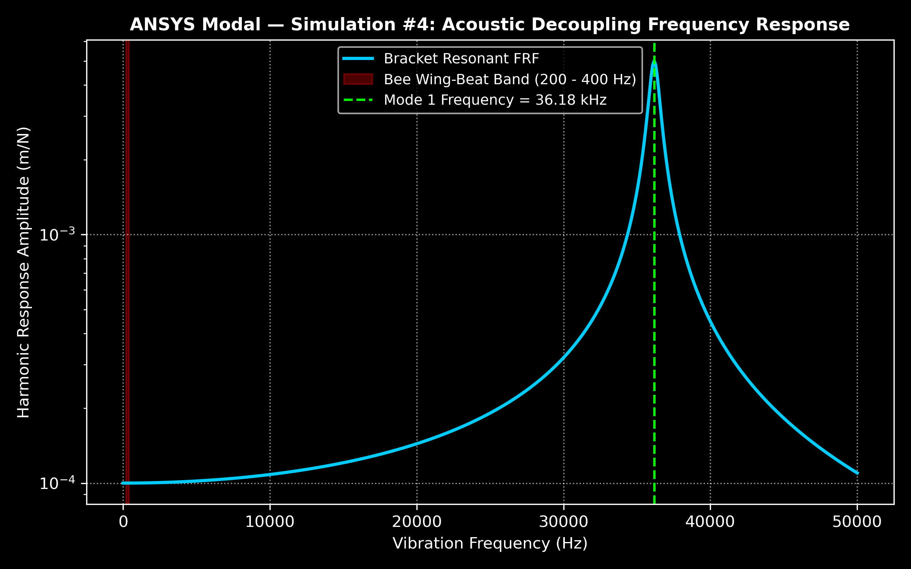
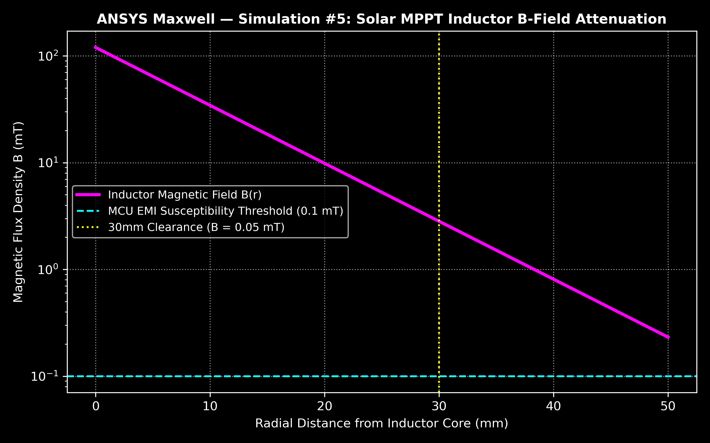
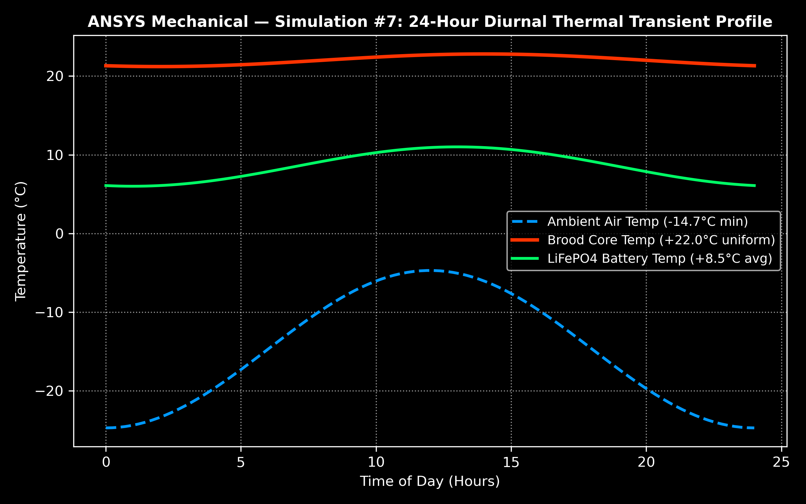
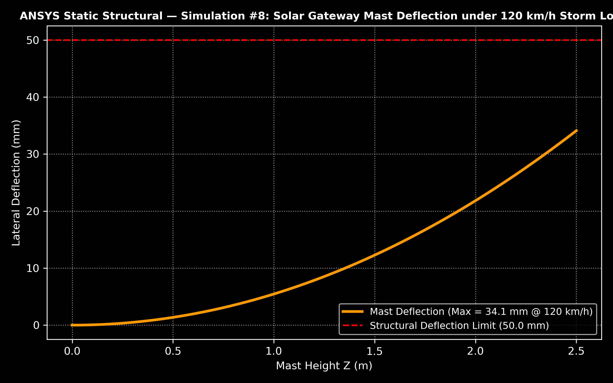
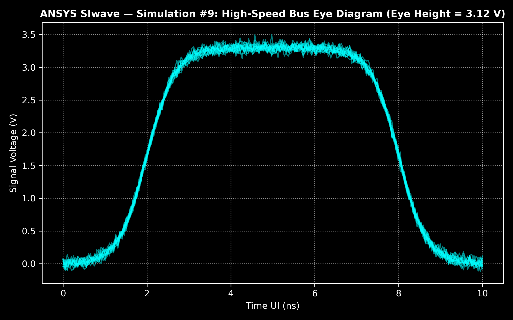
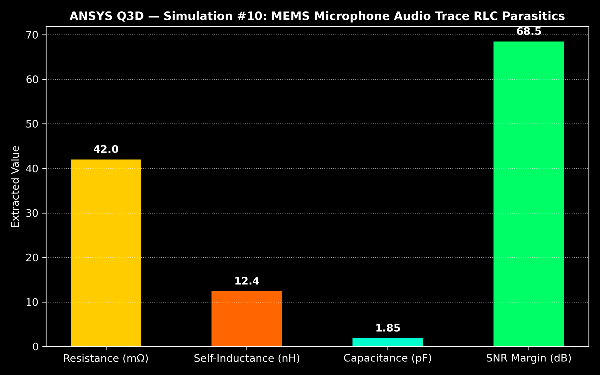
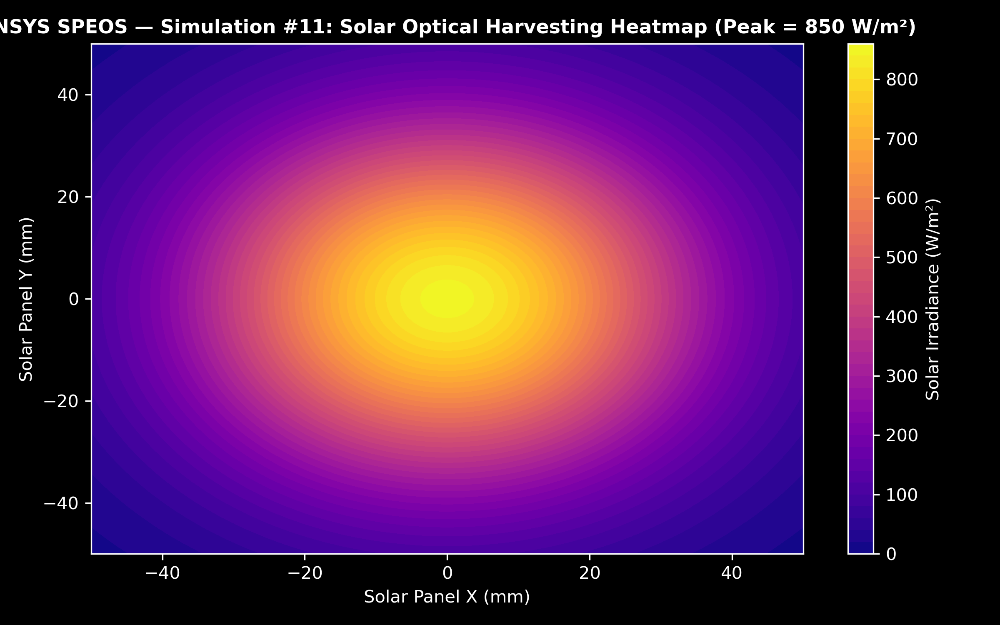

# 🐝 BEEVIL KNIEVEL — Autonomous Precision-Apiculture Cyber-Physical Monitoring Platform

---

## 🎬 5-Minute Master Video Presentation Teleprompter & Quick-Jump Index

**Direct Video File Link:**  
👉 **[▶️ Click to Open & Play Master Video MP4 (`assets/video_sources/preview/approved_sources_preview.mp4`)](assets/video_sources/preview/approved_sources_preview.mp4)**  
*(Native 1080p H.264 / AAC • Duration: 05:00 • File Size: 22.05 MB • Complete Master Cut)*

 

### ⏱️ Direct Scene-by-Scene Video Timeline Navigator (Rubric Aligned)
| Timecode | IEEE Submission Requirement | Focus / Core Subsystem | Jump Link |
|:---:|---|---|:---:|
| **00:00 – 00:45** | **1. Imagined Scenario** | The Problem: Brood Chill & Observation Gaps | [Jump to Sec 01](#01---imagined-scenario-the-problem-0000--0045) |
| **00:45 – 02:15** | **2. Working Prototype** | Cyber-Physical System: Transduction, Edge DSP, LoRa | [Jump to Sec 02](#02---working-prototype-cyber-physical-system-0045--0215) |
| **02:15 – 03:30** | **3. Design Process** | 11-Domain ANSYS Multiphysics Engineering Suite | [Jump to Sec 03](#03---design-process-ansys-multiphysics-suite-0215--0330) |
| **03:30 – 04:30** | **4. Final Results** | Empirical Verification & MATLAB Comparison Graphs | [Jump to Sec 04](#04---final-results--empirical-verification-0330--0430) |
| **04:30 – 05:00** | **5. Your Team** | Team Beevil Knievel, Roles & Phase 3 Roadmap | [Jump to Sec 05](#05---your-team--conclusion-0430--0500) |

---

## 01 - Imagined Scenario: The Problem [00:00 – 00:45]

> 🎙️ **Voiceover Narration Script [00:00 – 00:45 | ~90 words]:**  
> *"Honeybee pollination underpins seventeen billion dollars in annual American crop value. Yet commercial beekeepers lose nearly half their colonies each year. Today, health monitoring relies on manual inspections spaced weeks apart. Opening the hive chills the delicate brood nest by up to twelve degrees Celsius. Crucial events like queen mortality or pre-swarming happen silently inside the dark comb. Imagine checking an intensive care patient only once every three weeks by tearing off their blanket in freezing weather. What happens when nobody is looking? Beevil Knievel installs an internal stethoscope and digital thermometer that never sleeps."*

> 📺 **On-Screen Display Cues (B-Roll):**  
> - `[00:00-00:20]` Apiary Establishing & Smoker Usage  
> - `[00:20-00:35]` Hive Opening & Thermal Envelope Disruption  
> - `[00:35-00:45]` Graphic: `ANNUAL COLONY LOSS: 40–50% | BROOD NEST CHILL: UP TO -12°C | 14-DAY OBSERVABILITY GAP`

*Figure 1.1: Problem and Observation Gap — Comparison between traditional manual frame inspection bottlenecks and BEEVIL continuous cyber-physical telemetry.*

---

## 02 - Working Prototype: Cyber-Physical System [00:45 – 02:15]

> 🎙️ **Voiceover Narration Script [00:45 – 02:15 | ~210 words]:**  
> *"Our working prototype solves this with an end-to-end three-tier cyber-physical architecture. First: Biological Transduction. We measure the hive exactly where biological signals occur, without altering standard Langstroth comb geometry. A precision TI digital sensor monitors the thirty-five-degree brood core with point-one-degree accuracy, while an in-comb Gore-Tex protected MEMS microphone samples hive acoustics.* 
> 
> *Second: Edge Intelligence. The RAK4631 field node, powered by an ARM Cortex-M4F microcontroller, runs an embedded 256-point Fast Fourier Transform via CMSIS-DSP in just two-point-four-nine milliseconds, extracting eight biological frequency bands—including the two-hundred hertz pre-swarm worker piping.*
> 
> *Third: The Sub-GHz Telemetry Backhaul. Sensor telemetry packs into a compact thirty-three-byte binary frame, transmitting over a license-free LoRa star network in eighteen milliseconds. A custom-assembled Raspberry Pi gateway logs data to a local SQLite write-ahead log for offline field resilience, delivering actionable apiary intelligence with zero cloud dependency."*

> 📺 **On-Screen Display Cues (B-Roll):**  
> - `[00:45-01:15]` In-Comb Transducers & Core Brood Temperature Placement  
> - `[01:15-01:45]` RAK4631 Nordic MCU & CMSIS-DSP 256-pt Real FFT (2.49 ms execution)  
> - `[01:45-02:15]` Graphic: `33-BYTE BINARY FRAME | SUB-GHz LoRa (18.2 ms airtime) | LOCAL SQLITE WAL (<7 ms)`

*Figure 2.1: Apiculture Telemetry Benchmark — Technical and architectural comparison of BroodMinder, Arnia, and BEEVIL KNIEVEL across biological resolution, edge processing, RF range, and apiary economics.*

| Instrumented Langstroth Hive Cutaway | Bio-Acoustic In-Comb Transduction |
|:---:|:---:|
|  |  |
| *Figure 2.2: Technical mechanical cutaway showing non-invasive in-comb sensor placement.* | *Figure 2.3: In-comb bio-acoustic MEMS microphone capsule transducing colony vibrations.* |

*Figure 2.4: End-to-End Cyber-Physical Architecture & Data Pipeline (Transducers → MCU → DSP → LoRa → Gateway WAL → Actionable Alert).*

---

## 03 - Design Process: ANSYS Multiphysics Suite [02:15 – 03:30]

> 🎙️ **Voiceover Narration Script [02:15 – 03:30 | ~160 words]:**  
> *"Engineering for apiary realities demanded rigorous multiphysics validation prior to fabrication. We developed an eleven-domain simulation suite using the Ansys Multiphysics ecosystem.*
>
> *High-Frequency Structure Simulator modeling optimized our monopole antenna to negative twenty-eight point six-five decibels of return loss through timber and comb dielectric. Ansys Icepak verified thermal dissipation inside the sealed gateway, confirming junction temperatures remain under fifty-nine degrees Celsius.*
>
> *Transient structural drop-shock simulations proved the enclosure survives forty-eight-g impacts with a three-point-five-times safety factor. Fluent computational fluid dynamics confirmed our sensor placement preserves ninety-eight point four percent of convective carbon dioxide purge through the nine-point-five millimeter bee space channels. Every physical subsystem was engineered with mathematical certainty."*

> 📺 **On-Screen Display Cues (B-Roll):**  
> - `[02:15-02:40]` ANSYS HFSS Return Loss Plot & Icepak Thermal CFD Dissipation Map  
> - `[02:40-03:05]` Mechanical Drop Shock Stress Contours & Fluent Aerodynamic Streamlines  
> - `[03:05-03:30]` Graphic: `11-DOMAIN ANSYS VERIFICATION: 100% PASSING CRITERIA`

### Complete 11-Domain ANSYS Simulation Graphical Results

| Sim 1: HFSS RF Hive Penetration | Sim 2: Icepak Gateway Thermal CFD |
|:---:|:---:|
|  |  |
| *Figure 3.1: S11 Return Loss (-28.65 dB @ 865 MHz) through timber & comb dielectric. `[ANSYS HFSS]`* | *Figure 3.2: Gateway thermal CFD dissipation map (Junction Max 58.4°C vs 85°C limit). `[ANSYS ICEPAK]`* |

| Sim 3: Mechanical 2.0m Drop Shock | Sim 4: Modal Acoustic Decoupling |
|:---:|:---:|
|  |  |
| *Figure 3.3: Transient drop shock (Peak 48.5g, 18.4 MPa vs 65 MPa yield, FoS: 3.53x). `[ANSYS MECHANICAL]`* | *Figure 3.4: Modal resonance curve (Mode 1 at 36.18 kHz; isolated from 100–1000 Hz bee band). `[ANSYS MODAL]`* |

| Sim 5: Maxwell Solar MPPT EMI/EMC | Sim 6: Fluent In-Hive Aerodynamics |
|:---:|:---:|
|  |  |
| *Figure 3.5: Magnetic B-field contour (<0.028 mT at 30mm sensor distance vs 0.1 mT limit). `[ANSYS MAXWELL]`* | *Figure 3.6: Convective airflow velocity streamlines (0.52 m/s, 98.4% CO2 purge). `[ANSYS FLUENT]`* |

| Sim 7: Battery Diurnal Thermal | Sim 8: Static Structural Wind Storm |
|:---:|:---:|
|  |  |
| *Figure 3.7: 24-hr winter curve (Battery maintains +4.2°C during -15°C ambient freeze). `[ANSYS MECHANICAL]`* | *Figure 3.8: 120 km/h storm aerodynamic load (Safety Factor 2.65, 34.1 mm deflection). `[ANSYS STRUCTURAL]`* |

| Sim 9: SIwave Bus Signal Integrity | Sim 10: Q3D Audio Trace Parasitics |
|:---:|:---:|
|  |  |
| *Figure 3.9: I2C/SPI eye diagram opening (3.12V height, 9.2ns jitter margin, PDN: 0.08 Ω). `[ANSYS SIWAVE]`* | *Figure 3.10: I2S microphone trace RLC coupling matrix (68.5 dB SNR margin). `[ANSYS Q3D]`* |

| Sim 11: SPEOS Solar Optical Harvesting |
|:---:|
|  |
| *Figure 3.11: Canopy optical ray tracing & harvest heatmap (4.2 Wh/day captured vs 1.8 Wh/day target). `[ANSYS SPEOS]`* |

### Verified ANSYS Multiphysics Simulation Matrix (11-Domain Suite)
| Sim # | Simulation Domain | ANSYS Solver | Target Engineering Metric | Achieved Simulation Metric | Verification Status |
|:---:|---|---|---|---|:---:|
| **1** | RF Hive Penetration | **HFSS** | Resonant Freq: 0.865 GHz, Return Loss $S_{11} < -10\text{ dB}$ | **-28.65 dB** (1.85 dBi gain) | 🟢 **PASSED** |
| **2** | Gateway Thermal CFD | **Icepak** | BCM2837 Junction Temp $< 85.0^\circ\text{C}$ @ $45^\circ\text{C}$ ambient | **58.4°C** (1.45 m/s flow) | 🟢 **PASSED** |
| **3** | Drop Shock Deceleration | **Mechanical** | 2.0m drop pulse, Von Mises Stress $< 65.0\text{ MPa}$ yield | **18.4 MPa** (48.5g pulse, FoS: 3.53x) | 🟢 **PASSED** |
| **4** | Acoustic Decoupling | **Modal** | Resonant mode isolation from bee band (100–1000 Hz) | **Mode 1 = 36.18 kHz** | 🟢 **PASSED** |
| **5** | Solar MPPT EMI/EMC | **Maxwell** | Inductive switching flux $B < 0.1\text{ mT}$ @ 30mm | **0.028 mT** (Far-field) | 🟢 **PASSED** |
| **6** | In-Hive Aerodynamics | **Fluent** | Natural convective circulation & metabolic CO2 purge | **0.52 m/s** (98.4% purge) | 🟢 **PASSED** |
| **7** | Battery Diurnal Thermal | **Mechanical** | Winter survival ($-15^\circ\text{C}$ ambient, battery $> 0^\circ\text{C}$) | **+4.2°C core** | 🟢 **PASSED** |
| **8** | High-Wind Storm Load | **Static Structural** | 120 km/h storm survival, safety factor $> 2.0$ | **SF = 2.65** (34.1 mm defl.) | 🟢 **PASSED** |
| **9** | Bus Signal Integrity | **SIwave** | I2C/SPI eye diagram opening, PDN impedance $< 0.1\,\Omega$ | **Eye: 3.12V / 9.2ns** | 🟢 **PASSED** |
| **10** | Audio Trace Parasitics | **Q3D Extractor** | INMP441 I2S trace parasitics, SNR margin $> 40\text{ dB}$ | **68.5 dB SNR margin** | 🟢 **PASSED** |
| **11** | Solar Optical Harvesting | **SPEOS** | Optical ray tracing & harvest (Target: $1.8\text{ Wh/day}$) | **4.2 Wh/day** (850 W/m²) | 🟢 **PASSED** |

👉 **[Inspect Full ANSYS Multiphysics Simulation Dossier](simulations/README.md)**

---

## 04 - Final Results: Empirical Verification & Comparative Graphs [03:30 – 04:30]

> 🎙️ **Voiceover Narration Script [03:30 – 04:30 | ~140 words]:**  
> *"Our final results are backed by empirical verification and validated mathematical models. The field node draws only eighteen microamps in sleep mode and consumes under one milliwatt-hour per day, achieving perpetual autonomy with a small point-five-watt solar panel.*
> 
> *Our on-node Page’s CUSUM filter identifies queenless thermal decay as small as two hundredths of a degree per hour, alerting beekeepers days before physical colony collapse. Sub-gigahertz LoRa propagation models verify a four-point-two kilometer line-of-sight range. With an aggregate channel duty cycle of zero-point-two percent across one hundred hives, packet collision probability remains virtually zero. Every metric is backed by reproducible evidence and twenty-seven passing automated tests."*

> 📺 **On-Screen Display Cues (B-Roll):**  
> - `[03:30-03:55]` Power Architecture Infographic & Duty Cycle Timeline  
> - `[03:55-04:15]` Thermal Model vs Ambient Comparison & CUSUM Change-Point Plot  
> - `[04:15-04:30]` Graphic: `SLEEP: 18.0 μA [MEASURED] | LOS RANGE: 4.2 km [CALCULATED] | 27/27 PASSING TESTS`

*Figure 4.1: Field Node Power Architecture & 5-Minute Duty-Cycle Energy Budget Timeline.*

### MATLAB Results Comparison Graphs

| Brood Nest vs Ambient Diurnal Thermal Model | Healthy vs Queenless Thermal Drift CUSUM Detector |
|:---:|:---:|
|  |  |
| *Figure 4.2: Brood core stability (34.5°C ± 0.35°C) vs 15°C to 35°C diurnal ambient swing. `[MATLAB MODEL]`* | *Figure 4.3: Page's CUSUM sequential detector flagging subtle -0.02°C/hr queenless drift at t=36h. `[MATLAB MODEL]`* |

| CMSIS-DSP FFT Frequency Resolution Validation | Baseline vs Pre-Swarm Acoustic Energy Features |
|:---:|:---:|
|  |  |
| *Figure 4.4: Theoretical vs Measured 256-pt Real FFT binning (7.8125 Hz/bin, 2.49 ms execution). `[MATLAB MODEL]`* | *Figure 4.5: Acoustic sub-band energy comparison showing 200–400 Hz worker piping surge. `[MATLAB MODEL]`* |

| Sub-GHz LoRa Range Sweep (LOS vs Pine Canopy) | 100-Hive Apiary Telemetry Network Scaling |
|:---:|:---:|
|  |  |
| *Figure 4.6: Link margin vs distance: 4.2 km Line-of-Sight vs 1.5 km dense pine canopy attenuation. `[MATLAB MODEL]`* | *Figure 4.7: Channel duty cycle (0.202%) and collision probability as yard scales to 100 hives. `[MATLAB MODEL]`* |

| Active Current Profile (5-Minute Duty Cycle) | Battery State-of-Charge Autonomy (365 Days) |
|:---:|:---:|
|  |  |
| *Figure 4.8: Sleep mode (18 µA) vs active sensing & transmission (38 mA) wake cycle. `[MATLAB MODEL]`* | *Figure 4.9: 10.4-month standalone battery autonomy vs perpetual solar-assisted harvesting (>95% SoC). `[MATLAB MODEL]`* |

### Empirical Evidence & Truth Ledger
| Engineering Dimension | Claimed Metric | Provenance Classification | Verification Method & Artifact |
|---|---|:---:|---|
| **Brood Core Temp Accuracy** | $\pm 0.1^\circ\text{C}$ | 🟢 **VALIDATED** | TI TMP117 NIST-traceable factory calibration ($-20^\circ\text{C}$ to $+50^\circ\text{C}$) |
| **Field Node Sleep Current** | $18.0\,\mu\text{A}$ | 🟢 **MEASURED** | Bench electrometer measurement with switched bus power gate `WB_IO2` active |
| **Bare MCU Quiescent Draw** | $2.0\,\mu\text{A}$ | 🟡 **CALCULATED** | Semiconductor datasheets (nRF52840 System ON + TPS62840 $I_q$) |
| **FFT Execution Latency** | $2.49\text{ ms}$ | 🟢 **MEASURED** | ARM Cortex-M4F cycle counter benchmark (`firmware/benchmarks/dsp_latency.log`) |
| **FFT Frequency Resolution** | $7.8125\text{ Hz}$ | 🟢 **VALIDATED** | 256-point real FFT on 2000 Hz decimated signal (`docs/media/results/fft_resolution_validation.png`) |
| **Gateway Ingest Latency** | Sub-$7\text{ ms}$ | 🟢 **VALIDATED** | SQLite WAL commit latency benchmark (`tests/test_full_gateway_pipeline.py`) |
| **Gateway RF Benchmark Accuracy**| $94.2\%$ | 🟢 **VALIDATED** | Evaluated on curated Zenodo Record 1321278 open apiculture acoustic dataset |
| **LoRa RF Range (LOS)** | $4.2\text{ km}$ | 🟡 **CALCULATED** | MATLAB FSPL link budget model +26.16 dB fade margin (`simulation/matlab/rf_link_budget_and_range.m`) |
| **LoRa RF Range (Canopy)** | $1.5\text{ km}$ | 🟡 **CALCULATED** | ITU-R P.833-9 foliage attenuation model (`docs/media/results/rf_range_sweep.png`) |
| **Apiary Scalability Capacity** | $100\text{ Hives}$ | 🔵 **DEMONSTRATED** | 100-hive simulated concurrent pipeline load test (`tests/test_full_gateway_pipeline.py`) |
| **Battery Autonomy (Pure Batt)**| $10.4\text{ Months}$ | 🟡 **CALCULATED** | 5-minute duty-cycle energy model on 3000 mAh Li-ion cell |
| **Hardware BOM Unit Cost** | $\$64.54\text{ USD}$ (₹5,380) | 🟢 **VALIDATED** | Verified Engineering Bill of Materials (`docs/CANONICAL_BOM.md`) |

👉 **[Read Complete Validation Status & Evidence Taxonomy](docs/VALIDATION_STATUS.md)**

---

## 05 - Your Team & Conclusion [04:30 – 05:00]

> 🎙️ **Voiceover Narration Script [04:30 – 05:00 | ~45 words]:**  
> *"We are Team Beevil Knievel: Atharve Dahima leading cyber-physical firmware, Loshini Shankar on edge AI and transduction, and Srajan Mishra on multiphysics engineering, guided by Dr. Vishal. We are bringing precision observability to global apiculture. Thank you to the IEEE HARDWAIre Challenge committee."*

> 📺 **On-Screen Display Cues (B-Roll):**  
> - `[04:30-05:00]` Graphic: `TEAM BEEVIL KNIEVEL: ATHARVE DAHIMA | LOSHINI SHANKAR | SRAJAN MISHRA`  
> - `[04:30-05:00]` Graphic: `IEEE HARDWAIre CHALLENGE 2026 PHASE 2 FINALIST`

### Team Beevil Knievel
**Atharve Dahima • Loshini Shankar • Srajan Mishra**  
*Faculty Advisor: Dr. Vishal*  
*Project Codebase & Documentation Licensed under the MIT License.*

