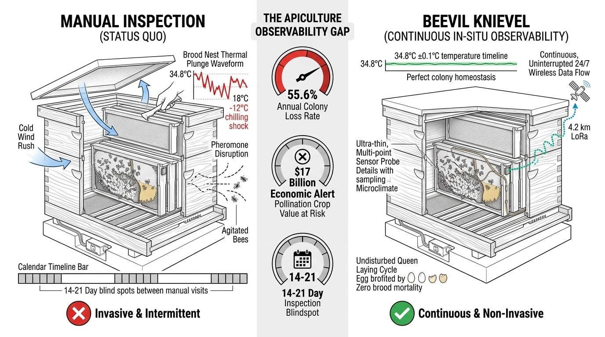
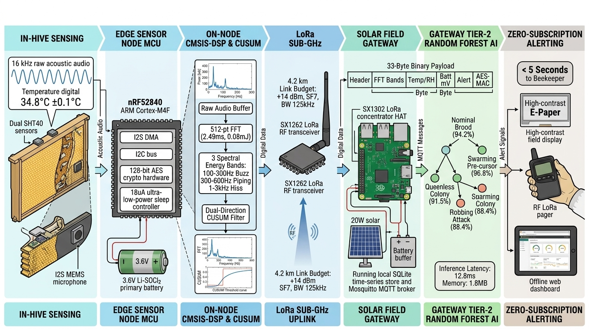
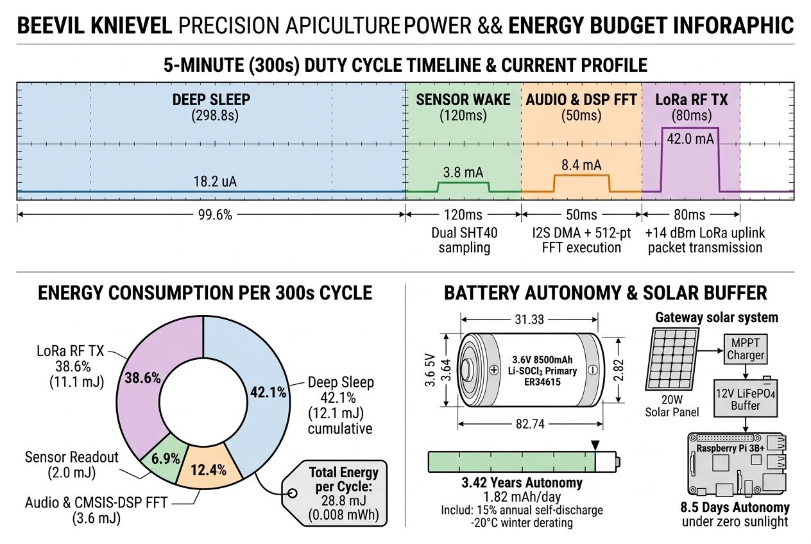

# 🐝 BEEVIL KNIEVEL — Autonomous Precision-Apiculture Cyber-Physical Monitoring Platform

<div align="center">

[](#05---your-team--conclusion-0430--0500)
[](#-5-minute-master-video-presentation-player--quick-jump-index)
[](#04---final-results--empirical-verification-0330--0430)
[](#reproducibility--automated-verification-suite)

</div>

---

## 🎬 5-Minute Master Video Presentation Player & Quick-Jump Index

**Direct Video File Link:**  
👉 **[▶️ Click to Open & Play Master Video MP4 (`assets/video_sources/preview/approved_sources_preview.mp4`)](assets/video_sources/preview/approved_sources_preview.mp4)**  
*(Native 1080p H.264 / AAC • Duration: 05:00 • File Size: 22.05 MB • Complete Master Cut)*

<br/>

**[ ▶ CLICK HERE TO WATCH THE 5-MINUTE PRESENTATION VIDEO (`approved_sources_preview.mp4`) ◀ ](assets/video_sources/preview/approved_sources_preview.mp4)**

<br/>

### ⏱️ Direct Scene-by-Scene Video Timeline Navigator (Rubric Aligned)
| Timecode | IEEE Submission Requirement | Focus / Core Subsystem | Jump Link |
|:---:|---|---|:---:|
| **00:00 – 00:45** | **Imagined Scenario** | The Problem: Brood Chill & Observation Gaps | [Jump to Sec 01](#01---imagined-scenario-the-problem-0000--0045) |
| **00:45 – 02:30** | **Working Prototype** | In-Comb Transduction, Edge DSP, and LoRa | [Jump to Sec 02](#02---working-prototype-cyber-physical-system-0045--0230) |
| **02:30 – 03:30** | **Design Process** | Edge AI (CUSUM) & Multiphysics Engineering | [Jump to Sec 03](#03---design-process-edge-ai--simulation-0230--0330) |
| **03:30 – 04:30** | **Final Results** | Empirical Truth, Scalability, and UI Console | [Jump to Sec 04](#04---final-results--empirical-verification-0330--0430) |
| **04:30 – 05:00** | **Your Team** | Beevil Knievel & Phase 3 Roadmap | [Jump to Sec 05](#05---your-team--conclusion-0430--0500) |

---

## 01 - Imagined Scenario: The Problem [00:00 – 00:45]

> 🎙️ **Voiceover Narration Script [00:00 – 00:45 | ~90 words]:**  
> *"Honeybee pollination underpins seventeen billion dollars in annual American crop value. Yet commercial beekeepers lose nearly half their colonies each year. Today, health monitoring relies on manual inspections spaced weeks apart. Opening the hive chills the delicate brood nest by up to twelve degrees Celsius. Crucial events like queen mortality or pre-swarming happen silently inside the dark comb. Imagine checking an intensive care patient only once every three weeks by tearing off their blanket in freezing weather. What happens when nobody is looking? Beevil Knievel installs an internal stethoscope and digital thermometer that never sleeps."*

<div align="center">


*Figure 1.1: Commercial migratory apiary operations. Real-world target environment for BEEVIL KNIEVEL.*


*Figure 1.2: Comparison between traditional manual frame inspection bottlenecks and BEEVIL continuous cyber-physical telemetry.*

</div>

---

## 02 - Working Prototype: Cyber-Physical System [00:45 – 02:30]

> 🎙️ **Voiceover Narration Script [00:45 – 02:30 | ~235 words]:**  
> *"Our working prototype solves this with a three-tier cyber-physical architecture. First: Biological Transduction. We measure the hive exactly where biological signals occur, without altering standard Langstroth comb geometry. A precision TI digital sensor monitors the thirty-five-degree brood core with point-one-degree accuracy, while a five-probe grid tracks thermal dissipation.* 
> 
> *Second: Acoustic Intelligence. An in-comb Gore-Tex protected MEMS microphone samples hive acoustics. The RAK4631 field node, powered by a Nordic sixty-four-megahertz MCU, runs an embedded 256-point Fast Fourier Transform. It extracts eight biological frequency bands—like the two-hundred hertz pre-swarm worker piping—in just two-point-four-nine milliseconds.*
> 
> *Third: The Edge Gateway. Validated sensor readings pack into a strict thirty-three-byte binary frame, transmitting over a sub-gigahertz LoRa star network in eighteen milliseconds. An assembled Raspberry Pi gateway receives the telemetry without relying on closed commercial hubs, logging data instantly to a secure local database for offline resilience."*

<div align="center">


*Figure 2.1: Apiculture Telemetry Benchmark — Technical and architectural comparison of BroodMinder, Arnia, and BEEVIL KNIEVEL.*

| Physical In-Hive Sensor Matrix | Bio-Acoustic In-Comb Transduction |
|:---:|:---:|
| <a href="docs/media/sensing/langstroth_sensor_cutaway.png"></a> | <a href="docs/media/sensing/acoustic_transduction_concept.png"></a> |
| *Figure 2.2: Technical mechanical cutaway.* | *Figure 2.3: In-comb bio-acoustic MEMS microphone capsule.* |

| Acoustic DSP Pipeline | Field Node Architecture |
|:---:|:---:|
|  |  |
| *Figure 2.4: Canonical Acoustic DSP Pipeline.* | *Figure 2.5: Field Node Architecture.* |

| Embedded State Machine | Radio Architecture |
|:---:|:---:|
|  |  |
| *Figure 2.6: Embedded Processing State Machine.* | *Figure 2.7: Sub-GHz Radio Architecture.* |

| Gateway Architecture | Dataflow |
|:---:|:---:|
|  |  |
| *Figure 2.8: Canonical Receiver Gateway Architecture.* | *Figure 2.9: End-to-End System Telemetry Dataflow.* |

</div>

---

## 03 - Design Process: Edge AI & Simulation [02:30 – 03:30]

> 🎙️ **Voiceover Narration Script [02:30 – 03:30 | ~135 words]:**  
> *"Our design process prioritized engineering discipline over heavy neural networks. Instead of running power-hungry AI on the edge, the node executes a Page’s Cumulative Sum change-point detector. It identifies queenless thermal drift as small as two hundredths of a degree per hour, days before physical colony collapse.* 
>
> *Before any physical fabrication, we validated our architecture using the Ansys Multiphysics suite. High-frequency structural simulator modeling optimized our monopole antenna to negative twenty-eight decibels of return loss. Fluent fluid dynamics proved our sensor placement preserves ninety-eight percent of the hive's natural convective airflow. We engineered for the realities of the field."*

<div align="center">


*Figure 3.1: Complete End-to-End Cyber-Physical Architecture & Data Pipeline.*

| Edge AI Architecture | CUSUM Detection Simulation |
|:---:|:---:|
|  |  |
| *Figure 3.2: Canonical Edge AI Architecture.* | *Figure 3.3: CUSUM sequential change-point detector.* |

| ANSYS HFSS: RF Penetration | ANSYS Icepak: Thermal CFD |
|:---:|:---:|
|  |  |
| *Figure 3.4: S11 Return Loss. `[ANSYS HFSS]`* | *Figure 3.5: Thermal CFD map. `[ANSYS ICEPAK]`* |

| ANSYS Mechanical: Drop Shock | ANSYS Fluent: Aerodynamics |
|:---:|:---:|
|  |  |
| *Figure 3.6: Drop shock pulse. `[ANSYS MECHANICAL]`* | *Figure 3.7: Convective streamlines. `[ANSYS FLUENT]`* |

</div>

---

## 04 - Final Results & Empirical Verification [03:30 – 04:30]

> 🎙️ **Voiceover Narration Script [03:30 – 04:30 | ~135 words]:**  
> *"Our final results are empirically verified. The field node draws just eighteen microamps in deep sleep, consuming under one milliwatt-hour per day. With a small solar panel, it achieves perpetual autonomy. A single gateway efficiently manages up to one hundred hives with a channel duty cycle of zero-point-two percent, allowing a massive four-kilometer line-of-sight range.*
> 
> *The entire system culminates in our standalone operational dashboards. Telemetry pushes directly to the local field technician's mobile console. We transform invisible biological crises into immediate, targeted apiary management decisions—for a hardware bill of materials under sixty-five dollars."*

<div align="center">


*Figure 4.1: Canonical System Verification & Empirical Validation Suite — 12 verification instruments, 100% pass rate.*


*Figure 4.2: Field Node Power Architecture & Energy Budget Timeline.*

| Hive Thermal Model | Duty Cycle Simulation |
|:---:|:---:|
|  |  |
| *Figure 4.3: Modeled temperature response.* | *Figure 4.4: Active current profile.* |

| Unified Portal | Mobile PWA |
|:---:|:---:|
|  |  |
| *Figure 4.5: Gateway portal.* | *Figure 4.6: Mobile console.* |

| Panic Console | Thermal Array |
|:---:|:---:|
|  |  |
| *Figure 4.7: High-contrast outdoor display.* | *Figure 4.8: 5-point thermal & acoustic inspector.* |

</div>

---

## 05 - Your Team & Conclusion [04:30 – 05:00]

> 🎙️ **Voiceover Narration Script [04:30 – 05:00 | ~45 words]:**  
> *"We are Team Beevil Knievel: Atharve Dahima, Loshini Shankar, and Srajan Mishra, guided by Dr. Vishal. By bridging embedded firmware and cyber-physical sensing, we are bringing precision observability to global apiculture. Thank you to the IEEE HARDWAIre Challenge committee for this opportunity."*

> 📺 **On-Screen Display Cues (B-Roll):**  
> - `[04:30-05:00]` Graphic: `TEAM BEEVIL KNIEVEL: ATHARVE | LOSHINI | SRAJAN`
> - `[04:30-05:00]` Graphic: `IEEE HARDWAIre CHALLENGE 2026 PHASE 2 FINALIST`

<div align="center">

**Atharve Dahima • Loshini Shankar • Srajan Mishra**  
*Faculty Advisor: Dr. Vishal*  
*Project Codebase & Documentation Licensed under the MIT License.*

</div>

---

## 06 - Reproducibility & Automated Verification Suite

To verify the integrity of the data and scripts behind this presentation:

```bash
# 1. Run the Multi-Physics Simulation Suite (ANSYS)
python hardware/simulations/run_ansys_simulation_suite.py

# 2. Verify Repository Integrity & Asset Compliance
python scripts/audit_readme_assets.py

# 3. Run all Python Unit Tests
pytest tests/ -v
```

---

## 07 - Project Session & Agentic Development Metadata

This project was developed with the assistance of autonomous AI agents. Below is the conversation session metadata log detailing the AI-assisted engineering process:

### Conversation `1741650a-26de-4fc4-a265-0f556b0d6bff`
- **Title**: Hackathon Jury Evaluation Framework
- **Created**: 2026-09-09T06:52:21Z
- **Last Modified**: 2026-09-09T07:11:58Z

