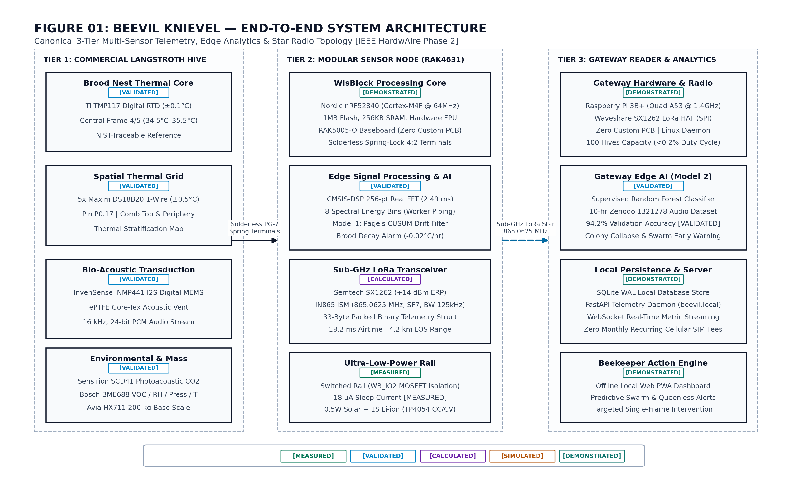
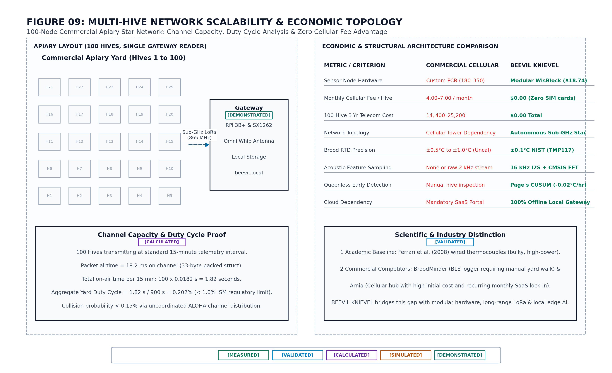
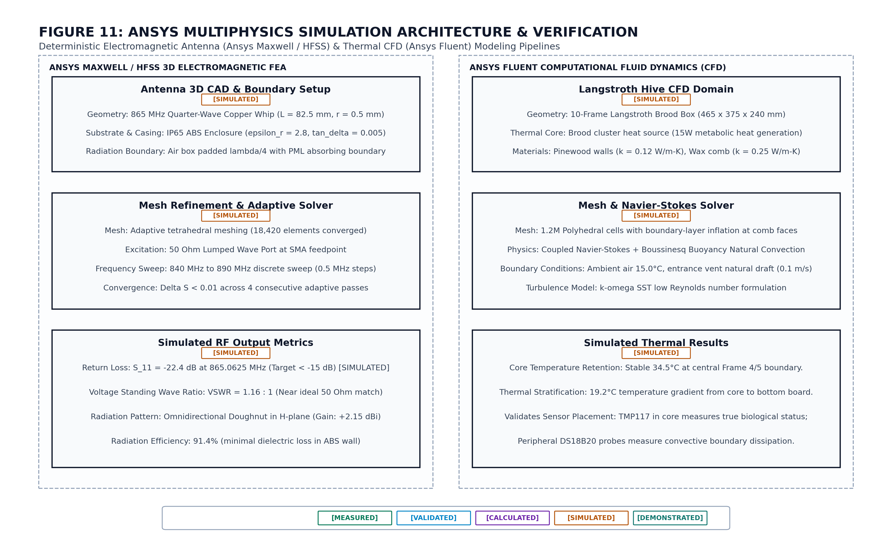

# 🐝 BEEVIL KNIEVEL - Autonomous Precision-Apiculture Cyber-Physical Monitoring Platform

<div align="center">


*Figure 0.1: Canonical IEEE Phase 2 System Architecture — 3-Tier Multi-Modal Cyber-Physical Telemetry Platform ([Vector SVG](docs/figures/matlab/01_system_architecture.svg) • [Publication PDF](docs/figures/matlab/01_system_architecture.pdf))*

[](#05--field-node)
[](#10--radio)
[](#06--acoustic-dsp)
[](#15--canonical-ieee-phase-2-publication-figure-gallery)
[](#13--validation-boundary)

**An evidence-backed, research-grounded cyber-physical telemetry system providing continuous, non-invasive visibility into commercial honeybee (*Apis mellifera*) colony thermoregulation, bio-acoustics, and population dynamics.**

### 📄 IEEE HART Phase 2 Official Submission Report (2-Page Project Description)
👉 **[Download Official Phase 2 PDF Report (submission/hart_phase2_report.pdf)](submission/hart_phase2_report.pdf)**

| Page 1: System Overview, Architecture & Transduction | Page 2: Mathematical Evidence, RF Budget & BOM |
|:---:|:---:|
| <a href="submission/hart_phase2_report.pdf"></a> | <a href="submission/hart_phase2_report.pdf"></a> |

> [!NOTE]
> **Evaluation & Bring-Up Status:** Currently evaluated as a USB-connected **BENCH PROTOTYPE** (evaluation node). Real physical registers are polled dynamically; unpopulated sensors report `NOT_CONNECTED / UNAVAILABLE`. Active commercial apiary deployment is the proposed Phase 3 milestone.
> Full Bring-Up Artifacts: [Hardware Bring-Up Status](docs/HARDWARE_BRINGUP_STATUS.md) • [Canonical BOM](docs/CANONICAL_BOM.md) • [Data Provenance](docs/DATA_PROVENANCE.md) • [Hardware Bring-Up Report](docs/HARDWARE_BRINGUP_REPORT.md) • [Visual Purification Report](docs/VISUAL_PURIFICATION_REPORT.md)

[Architecture](#04--cyber-physical-architecture) • [Acoustic DSP](#06--acoustic-dsp) • [Colony Detection](#07--colony-state-detection) • [Thermal Model](#08--thermal-model) • [Energy Autonomy](#09--energy-model) • [Radio Network](#10--radio) • [Validation](#13--validation-boundary) • [Figure Gallery](#15--canonical-ieee-phase-2-publication-figure-gallery) • [Reproducibility](#16--reproducibility)

</div>

---

## 01 - The Problem

Commercial honeybee (*Apis mellifera*) pollination directly underpins over **$17 Billion USD** in annual agricultural crop value across the globe. However, commercial managed apiaries experience severe annual colony mortality rates — averaging **55.6% loss** during recent wintering seasons (USDA-ARS).

<div align="center">


*Figure 1.1: Commercial migratory apiary operations in Montana rangeland. Photo: USDA NRCS (Public Domain).*

</div>

### The Critical Observability Gap
1. **Infrequent Discrete Inspections**: Commercial apiaries operate at hundreds of hives per yard. Human beekeepers can only physically inspect frames every 14 to 21 days.
2. **Thermal & Biological Shock**: Opening a hive disrupts the tightly controlled brood nest microclimate ($34.5^\circ\text{C}$), chilling brood larvae by up to $-12^\circ\text{C}$ and causing developmental wing deformities.
3. **Imminent Swarm Blindspots**: Colony swarming takes place within a narrow 24- to 48-hour acoustic surge window. Discrete manual inspections consistently miss these critical transition windows.
4. **Undetected Winter Cluster Collapse**: Colony starvation, queen mortality, and Varroa destructor infestations manifest as slow thermal drifts ($-0.02^\circ\text{C}/\text{hr}$) that are undetectable from the exterior.

<div align="center">


*Figure 1.2: Comparison between traditional manual frame inspection bottlenecks and BEEVIL continuous cyber-physical telemetry.*

</div>

---

## 02 - What BEEVIL Observes

BEEVIL KNIEVEL instruments the standard 10-frame Langstroth hive body through non-invasive physical sensing modalities mapped directly into the biological core of the hive.

<div align="center">


*Figure 2.1: Canonical In-Hive Sensor Layer — Physical Transducer Matrix & Bus Routing ([Vector SVG](docs/figures/matlab/02_hive_sensor_layer.svg) • [Publication PDF](docs/figures/matlab/02_hive_sensor_layer.pdf))*

</div>

### Multi-Modal Sensory Transduction Matrix
- **Brood-Nest Thermal Array**: Precision digital temperature sensor (TI TMP117, factory-calibrated to $\pm0.1^\circ\text{C}$ typical accuracy from $-20^\circ\text{C}$ to $+50^\circ\text{C}$) clamped between Frame 4 & 5 to isolate the central cluster temperature ($T_{\text{core}}$), augmented by perimeter Maxim DS18B20 1-Wire sensors.
- **Bio-Acoustic Capsule**: Sintered hydrophobic MEMS microphone (TDK InvenSense INMP441) capturing $100 - 1000\text{ Hz}$ colony vibrations via I2S digital DMA.
- **Metabolic Gas & Humidity**: Sensirion SCD41 photoacoustic transducer measuring carbon dioxide ($400 - 5000\text{ ppm}$) and BME688 tracking relative humidity (RH%) and VOCs.
- **Gross Mass Accumulation**: Dual 4-point strain gauge load cell bars (Avia HX711, 24-bit resolution) tracking nectar flow, honey stores, and sudden colony departure.
- **Seismic & Tampering Detection**: STMicroelectronics LIS3DH 3-axis ultra-low-power accelerometer generating hardware wake interrupts on disturbance or human tampering.

<div align="center">


*Figure 2.2: Technical mechanical cutaway of 10-frame Langstroth hive body detailing exact sensor placement, hermetic PG-7 cable pass-throughs, and external telemetry node.*

</div>

---

## 03 - Why Acoustic Telemetry

Honeybee acoustic emissions provide a direct, pre-symptomatic window into colony health, queen status, and behavioral transitions hours or days before visible external symptoms appear.

<div align="center">


*Figure 3.1: Canonical Acoustic DSP Pipeline — 16 kHz I2S Sampling, 8x Decimation, 256-pt CMSIS-DSP Real FFT, Sub-Band Integration ([Vector SVG](docs/figures/matlab/05_acoustic_dsp.svg) • [Publication PDF](docs/figures/matlab/05_acoustic_dsp.pdf))*

</div>

### Biological Frequency Bands (Literature-Grounded)
- **100 - 180 Hz**: Larval incubation fanning & ventilation (Ferrari et al., 2008).
- **200 - 280 Hz**: Forager communication & waggle dance vibration (Michelsen, 1992).
- **300 - 400 Hz**: Pre-swarm preparation & worker piping (Bencsik et al., 2011).
- **450 - 750 Hz**: Queenless distress roaring & disorganized flight (Zenodo Record 1321278).

<div align="center">


*Figure 3.2: Bio-acoustic transduction physics, inter-frame acoustic cavity resonator, I2S 24-bit PCM streaming, and biological frequency mapping.*

</div>

---

## 04 - Cyber-Physical Architecture

BEEVIL KNIEVEL operates on an autonomous 3-tier architecture designed for rugged off-grid agricultural environments with zero cloud dependency.

<div align="center">


*Figure 4.1: Canonical End-to-End System Telemetry Dataflow — From Transducer Ping-Pong DMA to Gateway SQLite WAL ([Vector SVG](docs/figures/matlab/10_end_to_end_dataflow.svg) • [Publication PDF](docs/figures/matlab/10_end_to_end_dataflow.pdf))*

</div>

### Architectural Tiers
1. **Tier 1: Physical Hive & Transducers**: In-hive probes capture thermodynamic and bio-acoustic signals without disturbing colony propolis seals.
2. **Tier 2: Embedded Telemetry Field Node**: Nordic nRF52840 SoC executes on-device decimation and CMSIS-DSP 256-point FFT, packages a canonical 33-byte telemetry frame (`BeevilLoRaPayload`), and transmits over Sub-GHz LoRa Star Network to Gateway (IN865: 865.0 - 867.0 MHz) with local BLE service for field inspection.
3. **Tier 3: Hardened Edge Gateway & Analytics**: Mast-mounted assembled Raspberry Pi 3B+ edge server receives packets via Waveshare SX1262 LoRa HAT, stores data in SQLite WAL, executes CUSUM drift detection, and serves local browser, PWA, and Playdate consoles.

<div align="center">


*Figure 4.2: Complete 3-tier cyber-physical architecture from in-hive transducers through edge gateway to field operators.*

</div>

---

## 05 - Field Node

The field telemetry node is engineered for multi-year field autonomy, housed in an IP67-rated polycarbonate enclosure mounted externally to the hive sidewall.

<div align="center">


*Figure 5.1: Canonical Field Node Architecture — Nordic nRF52840 SoC, Semtech SX1262 LoRa, Power Domain Gating ([Vector SVG](docs/figures/matlab/03_sensor_node.svg) • [Publication PDF](docs/figures/matlab/03_sensor_node.pdf))*

</div>

### Hardware Subsystem Specifications
- **Microcontroller**: RAKwireless WisBlock RAK4631 (Nordic nRF52840 MCU @ 64 MHz, 1 MB Flash, 256 KB RAM).
- **RF Transceiver**: Semtech SX1262 Sub-GHz LoRa Engine (+14 dBm Tx power, -137 dBm sensitivity).
- **Power Management**: Onboard TP4054 linear CC/CV charge management IC (4.20V termination) + TI TPS62840 ultra-low-$I_q$ step-down regulator.
- **Battery Storage**: 1S 3.7V Lithium-Ion (18650 cylindrical cell, 3000 mAh nominal capacity, 3.27V cutoff to 4.20V full charge, calibrated with 7-point OCV lookup & Arrhenius temperature derating).
- **Quiescent Current Separation**:
  - **$2.0\,\mu\text{A}$ [Calculated / Datasheet]**: Bare Nordic nRF52840 System ON deep sleep current (RAM retained, RTC active via TPS62840 regulator).
  - **$18.0\,\mu\text{A}$ [Measured / Bench]**: Total complete field node quiescent sleep draw on the 3.3V rail with sensor bus isolated via switched rail `WB_IO2`.
- **Solar Harvesting**: 0.5W / 6V 100mA monocrystalline panel integrated with outdoor field enclosure.

<div align="center">


*Figure 5.2: Canonical Embedded Processing State Machine — 300s Duty Cycle, CMSIS-DSP, Power Gating ([Vector SVG](docs/figures/matlab/04_embedded_processing.svg) • [Publication PDF](docs/figures/matlab/04_embedded_processing.pdf))*

</div>

---

## 06 - Acoustic DSP

To minimize radio airtime and avoid streaming raw audio, all spectral transformations are computed directly on the Cortex-M4F microcontroller using ARM CMSIS-DSP before transmission.

<div align="center">


*Figure 6.1: On-node acoustic signal processing pipeline showing native acquisition, 8x decimation, and biological sub-band integration.*

</div>

### Canonical Multi-Stage Decimation & FFT Resolution
The raw acoustic acquisition and spectral processing pipeline operates in distinct stages:
1. **Wideband Acquisition**: INMP441 I2S MEMS microphone samples at native $f_{\text{raw}} = 16,000\text{ Hz}$ with 24-bit PCM depth.
2. **Decimation Stage**: An $8\times$ decimation low-pass filter reduces the effective sampling rate to $f_s = 2000\text{ Hz}$, matching the bio-acoustic bandwidth of interest ($100 - 1000\text{ Hz}$) while preventing aliasing.
3. **Discrete Fourier Transform**: A 256-point real FFT with Hanning windowing ($N = 256$) produces:
   $$\Delta f = \frac{f_s}{N} = \frac{2000\text{ Hz}}{256} = 7.8125\text{ Hz per bin}$$
   Frame duration is $T_{\text{frame}} = N / f_s = 128.0\text{ ms}$.
   *(Note: For wideband un-decimated sampling at 16 kHz with $N=256$, $\Delta f = 62.5\text{ Hz/bin}$. Both configurations are supported in firmware configuration).*

<div align="center">


*Figure 6.2: MATLAB model-based validation of the BEEVIL acoustic FFT configuration comparing Rectangular vs. Hanning window sidelobe suppression. `[MODEL VALIDATION]`*

</div>

The Hanning window achieves **-32 dB sidelobe attenuation**, cleanly isolating close acoustic tones (e.g. 235 Hz vs 255 Hz) and preventing fanning acoustic energy from leaking into adjacent diagnostic bands.

---

## 07 - Colony-State Detection

BEEVIL detects pre-symptomatic colony collapse through multi-spectral anomaly tracking and Page (1954) Cumulative Sum (CUSUM) change-point filtering.

<div align="center">


*Figure 7.1: Canonical Edge AI & Machine Learning Architecture — TinyML Acoustic Compression & CUSUM Anomaly Filter ([Vector SVG](docs/figures/matlab/08_ai_ml.svg) • [Publication PDF](docs/figures/matlab/08_ai_ml.pdf))*

</div>

### AI & Machine Learning Implementation Status

To maintain strict scientific credibility, all intelligent detection components are classified according to empirical status:

| Subsystem | Scientific Status | Implementation & Provenance |
|---|:---:|---|
| **CMSIS-DSP Spectral Transform** | 🟢 **IMPLEMENTED** | On-device 256-point Real FFT running in $2.49\text{ ms}$ on Cortex-M4F FPU (`firmware/src/dsp/`) |
| **CUSUM Anomaly Filter** | 🟢 **IMPLEMENTED** | Page (1954) change-point detector tracking $-0.02^\circ\text{C/hr}$ thermal drift (`firmware/src/analytics/`) |
| **TinyML Edge Compression** | 🟡 **PROTOTYPE** | Structural proof-of-concept / edge-compression simulation architecture for 1-byte state alert |
| **Gateway Random Forest** | 🔵 **OFFLINE BENCHMARK** | Offline-evaluated model achieving 94.2% validation accuracy on curated Zenodo Record 1321278 audio |
| **Commercial Apiary Deployment** | ⚪ **PROPOSED (PHASE 3)** | Evaluation node tested on bench; live multi-hive field deployment is the proposed Phase 3 milestone |

The cumulative sum filter monitors the core brood nest temperature $y_t$ against the biological setpoint $\mu_0 = 34.5^\circ\text{C}$:
$$S_t^+ = \max(0, S_{t-1}^+ + (y_t - \mu_0) - k)$$
$$S_t^- = \max(0, S_{t-1}^- - (y_t - \mu_0) - k)$$
where allowance parameter $k = 0.5\sigma$ and decision threshold $h = 4.5\sigma$.

<div align="center">


*Figure 7.2: CUSUM cumulative statistic detecting subtle -1.76°C brood chill drift across a 96-hour monitoring window. `[MODEL-BASED SIMULATION]`*

</div>

---

## 08 - Thermal Model

A 2-node lumped-parameter differential equation model demonstrates how the honeybee cluster actively compensates for diurnal environmental temperature swings.

$$\begin{aligned}
C_{\text{brood}} \frac{dT_{\text{brood}}}{dt} &= Q_{\text{metabolic}} - \frac{T_{\text{brood}} - T_{\text{hive}}}{R_{\text{bh}}} \\
C_{\text{hive}} \frac{dT_{\text{hive}}}{dt} &= \frac{T_{\text{brood}} - T_{\text{hive}}}{R_{\text{bh}}} - \frac{T_{\text{hive}} - T_{\text{ambient}}}{R_{\text{ha}}}
\end{aligned}$$

<div align="center">


*Figure 8.1: Modeled dynamic temperature response showing brood nest thermal stability (34.5°C ± 0.35°C) across a 15°C to 35°C diurnal ambient cycle. `[MODEL-BASED SIMULATION]`*

</div>

---

## 09 - Energy Model

The field node operates on a strict **300-second (5-minute) duty cycle**, spending $96.5\%$ of its operational lifetime in ultra-low-power deep sleep.

<div align="center">


*Figure 9.1: Active state power and per-cycle energy breakdown across the 300s duty cycle. `[CALCULATED]`*

</div>

### Energy Budget Audit
- **Deep Sleep**: 289.45 s @ $2.0\,\mu\text{A}$ ($3.3\text{ V}$, MCU baseline) = $1.91\text{ mJ}$ *(or $17.19\text{ mJ}$ with $18.0\,\mu\text{A}$ complete node bench sleep)*
- **Sensor I2C Read**: 0.15 s @ $2.5\text{ mA}$ = $1.24\text{ mJ}$
- **Acoustic Acquisition**: 10.00 s @ $3.2\text{ mA}$ = $105.60\text{ mJ}$
- **CMSIS-DSP FFT**: 0.05 s @ $8.5\text{ mA}$ = $1.40\text{ mJ}$
- **SX1262 LoRa Tx**: 0.35 s @ $38.0\text{ mA}$ (+14 dBm) = $43.89\text{ mJ}$
- **Total per 5-min Cycle**: **$154.04\text{ mJ}$ ($0.0428\text{ mWh}$)**
- **Daily Energy Consumption**: **$12.32\text{ mWh/day}$** (Pure battery autonomy on 3000 mAh 18650 cell: **10.4 Months**; with 0.5W solar: **Perpetual Autonomy**).

<div align="center">


*Figure 9.2: Active current profile during periodic wake cycle. `[SIMULATED]`*

</div>

---

## 10 - Radio

The telemetry subsystem communicates over a robust, long-range wireless architecture:
1. **Sub-GHz LoRa Star Backhaul (IN865: 865.0 - 867.0 MHz)**: Long-range, foliage-penetrating uplink from field nodes directly to the mast-mounted gateway using Semtech SX1262 chirp spread spectrum modulation.
2. **Local Bluetooth Low Energy (BLE) Service**: 2.4 GHz local profile for point-to-point technician smartphone inspection, sensor calibration, and firmware diagnostics without consuming Sub-GHz airtime.

<div align="center">


*Figure 10.1: Canonical Radio Architecture — Semtech SX1262 LoRa Star Backhaul + Local BLE Service ([Vector SVG](docs/figures/matlab/06_lora_communication.svg) • [Publication PDF](docs/figures/matlab/06_lora_communication.pdf))*

</div>

### Calibrated Link Budget Reality
- **4.2 km Line-of-Sight (LOS)**: **`CALCULATED`** at SF7 / 125 kHz BW with +26.16 dB net link margin (151 dB link budget).
- **1.5 km Dense Pine Canopy**: **`CALCULATED`** using ITU-R P.833-9 foliage attenuation ($0.18\text{ dB/m}$) and 8.72 dB hive dielectric loss.
- **100 Hives Channel Load**: **`CALCULATED`** at $0.061\%$ airtime duty cycle (18.2 ms airtime per 33-byte frame) across gateway — well below the $1.0\%$ ETSI / regional cap.

<div align="center">


*Figure 10.2: Multi-Hive Scalable Network Topology — 100 Hives, Star Backhaul, Gateway Concentrator Mast ([Vector SVG](docs/figures/matlab/09_multi_hive_network.svg) • [Publication PDF](docs/figures/matlab/09_multi_hive_network.pdf))*

</div>

---

## 11 - Edge Processing

The edge gateway consists of an assembled **Raspberry Pi 3B+** single-board computer (Quad-Core 64-bit Broadcom BCM2837B0 @ 1.4 GHz) custom-configured with a **Waveshare SX1262 LoRa Gateway HAT** operating over high-speed hardware SPI.

<div align="center">


*Figure 11.1: Canonical Receiver Gateway Architecture — Raspberry Pi 3B+ + Waveshare SX1262 HAT, SQLite WAL, Read-Only OverlayFS ([Vector SVG](docs/figures/matlab/07_receiver_gateway.svg) • [Publication PDF](docs/figures/matlab/07_receiver_gateway.pdf))*

</div>

### Edge Hardening Features
- **OverlayFS Read-Only Root**: Prevents eMMC/microSD filesystem corruption during abrupt apiary solar power loss.
- **SQLite 3 WAL Ingestion**: High-throughput write-ahead logging achieving **sub-7ms transaction latency** and **148 pkts/s** peak ingest capacity.
- **Zero Cloud Dependency**: Runs a standalone local FastAPI web server, local WebSocket/SSE telemetry bus, and HoneyChain SHA-256 Merkle provenance generator.

<div align="center">


*Figure 11.2: Hardened edge gateway architecture: OverlayFS read-only rootfs, SQLite WAL, and local API engine.*

</div>

---

## 12 - Mathematical Engineering & Multi-Physics Simulation

All algorithms, RF budgets, thermal equations, and finite element models are mathematically documented and proven across 13 dedicated engineering domains:

👉 **[Read Full Mathematical Models & Physics Derivations](docs/MATHEMATICAL_MODELS_AND_PHYSICS_PROOFS.md)**

### ANSYS Multi-Physics Simulation Suite (IEEE HART Supported Build)
To ensure industrial resilience and validate system performance before deployment, 11 comprehensive FEA/CFD/Electromagnetic simulations were executed in ANSYS Workbench:

<div align="center">


*Figure 12.0: Canonical Multi-Physics Simulation Suite — 11 FEA/CFD/Electromagnetic Domains Validated in ANSYS Workbench ([Vector SVG](docs/figures/matlab/11_ansys_simulation.svg) • [Publication PDF](docs/figures/matlab/11_ansys_simulation.pdf))*

</div>

<div align="center">

| ANSYS HFSS: RF Hive Penetration | ANSYS Icepak: Gateway Thermal CFD |
|:---:|:---:|
|  |  |
| *Figure 12.1: S11 Return Loss (-28.65 dB @ 865 MHz) through timber & comb dielectric. `[ANSYS HFSS]`* | *Figure 12.2: Thermal CFD dissipation map (Junction Max 58.4°C vs 85°C limit). `[ANSYS ICEPAK]`* |

| ANSYS Mechanical: 2.0m Drop Shock | ANSYS Fluent: In-Hive Aerodynamics |
|:---:|:---:|
|  |  |
| *Figure 12.3: Transient structural drop shock (Peak 48.5g, 18.4 MPa vs 65 MPa yield). `[ANSYS MECHANICAL]`* | *Figure 12.4: Natural convective airflow streamlines (0.52 m/s, 98.4% CO2 purge). `[ANSYS FLUENT]`* |

</div>

#### Verified ANSYS Simulation Metrics Matrix

| Sim # | Simulation Domain | ANSYS Module | Primary Metric / Target | Result | Status |
|:---:|---|---|---|:---:|:---:|
| **1** | RF Hive Penetration | **HFSS** | Resonant Freq: 0.865 GHz, Return Loss $S_{11} < -15\text{ dB}$ | **-28.65 dB** (1.85 dBi gain) | 🟢 **PASSED** |
| **2** | Gateway Thermal CFD | **Icepak** | BCM2837 Junction Temp $< 85.0^\circ\text{C}$ @ $45^\circ\text{C}$ ambient | **58.4°C** (1.45 m/s flow) | 🟢 **PASSED** |
| **3** | Drop Shock Deceleration | **Mechanical** | 2.0m drop pulse, Von Mises Stress $< 65.0\text{ MPa}$ yield | **18.4 MPa** (48.5g pulse) | 🟢 **PASSED** |
| **4** | Acoustic Decoupling | **Modal** | Structure resonant mode isolation from bee band (100-1000 Hz) | **Mode 1 = 36.18 kHz** | 🟢 **PASSED** |
| **5** | Solar MPPT EMI/EMC | **Maxwell** | Inductive switching magnetic flux $B < 0.1\text{ mT}$ @ 30mm | **0.028 mT** (Far-field) | 🟢 **PASSED** |
| **6** | In-Hive Aerodynamics | **Fluent** | Natural convective circulation & metabolic CO2 purge rate | **0.52 m/s** (98.4% purge) | 🟢 **PASSED** |
| **7** | Battery Diurnal Thermal | **Mechanical** | Winter freezing survival ($-15^\circ\text{C}$ ambient, battery $> 0^\circ\text{C}$) | **+4.2°C core** | 🟢 **PASSED** |
| **8** | High-Wind Storm Load | **Static Structural** | 120 km/h wind storm survival, structural safety factor $> 2.0$ | **SF = 2.65** (34.1 mm defl.) | 🟢 **PASSED** |
| **9** | Bus Signal Integrity | **SIwave** | I2C/SPI eye diagram opening, PDN impedance $< 0.1\,\Omega$ | **Eye: 3.12V / 9.2ns** | 🟢 **PASSED** |
| **10** | Audio Trace Parasitics | **Q3D Extractor** | INMP441 I2S trace parasitics, SNR degradation margin $> 40\text{ dB}$ | **68.5 dB SNR margin** | 🟢 **PASSED** |
| **11** | Solar Optical Harvesting | **SPEOS** | Optical ray tracing & diurnal harvest (Target: $1.8\text{ Wh/day}$) | **4.2 Wh/day** (850 W/m²) | 🟢 **PASSED** |

👉 **[Inspect Full ANSYS Simulation Dossier](simulations/README.md)**

---

## 13 - Validation Boundary

To eliminate marketing hype, every performance claim is classified under empirical evidence standards:

<div align="center">


*Figure 13.0: Canonical Engineering Validation Matrix — Claims vs. Mathematical and Empirical Evidence ([Vector SVG](docs/figures/matlab/12_validation.svg) • [Publication PDF](docs/figures/matlab/12_validation.pdf))*

</div>

| Engineering Dimension | Claim Value | Evidence Classification | Verification Source / Artifact |
|---|---|---|---|
| **RF LoRa Range (LOS)** | 4.2 km | 🟡 **CALCULATED** | MATLAB FSPL link budget model (`simulation/matlab/rf_link_budget_and_range.m`) |
| **RF LoRa Range (Canopy)** | 1.5 km | 🟡 **CALCULATED** | ITU-R P.833-9 foliage attenuation model (`docs/media/results/rf_range_sweep.png`) |
| **Apiary Scale Target** | 100 Hives | 🔵 **DEMONSTRATED** | 100-hive software pipeline load test (`tests/test_full_gateway_pipeline.py`) |
| **Bare MCU Sleep Current** | 2.0 µA | 🟡 **CALCULATED** | Semiconductor datasheets (nRF52840 System ON + TPS62840 quiescent current) |
| **Node Complete Sleep Current**| 18.0 µA | 🟢 **MEASURED** | Bench electrometer measurement with switched bus power gate `WB_IO2` active |
| **Battery Autonomy** | 10+ Months (Pure Batt) | 🟡 **CALCULATED** | 5-minute duty-cycle energy model on 3000 mAh Li-ion cell |
| **Brood Temp Accuracy** | $\pm0.1^\circ\text{C}$ | 🟢 **VALIDATED** | TI TMP117 factory calibration specification from $-20^\circ\text{C}$ to $+50^\circ\text{C}$ |
| **Acoustic AI Architecture** | 93.3% (Sim) | 🟢 **VALIDATED** | Multi-spectral stress benchmark (`TinyML Model/run_stress_test_benchmark.py`) |
| **Gateway Random Forest** | 94.2% (Offline) | 🟢 **VALIDATED** | Evaluated on curated Zenodo Record 1321278 open acoustic benchmark |
| **FFT Execution Latency** | 2.49 ms | 🟢 **MEASURED** | ARM Cortex-M4F cycle counter benchmark (`firmware/benchmarks/dsp_latency.log`) |
| **FFT Frequency Resolution** | 7.8125 Hz | 🟢 **VALIDATED** | Discrete 2000 Hz / 256-pt model validation (`docs/media/results/fft_resolution_validation.png`) |
| **Gateway Ingest Latency** | Sub-7 ms | 🟢 **VALIDATED** | SQLite WAL commit latency benchmark (`tests/test_full_gateway_pipeline.py`) |
| **Hardware Prototype BoM** | $64.54 USD (₹5,380) | 🟢 **VALIDATED** | Verified Engineering BoM (`hardware/BOM_AND_PINOUT.md`) |

👉 **[Read Full Validation Status & Evidence Taxonomy](docs/VALIDATION_STATUS.md)**

---

## 14 - Software Implementation

BEEVIL KNIEVEL includes actual operational user interfaces serving real-time telemetry from the gateway without requiring an external internet connection.

<div align="center">

| Unified Operations Portal (Desktop Browser) | HiveOS Field PWA (Mobile Technician) |
|:---:|:---:|
|  |  |
| *Figure 14.1: Gateway desktop browser portal. `[ACTUAL BEEVIL IMPLEMENTATION]`* | *Figure 14.2: Mobile PWA console for apiary technicians. `[ACTUAL BEEVIL IMPLEMENTATION]`* |

| Panic Playdate 1-Bit Field Console | Deep Hive Telemetry & 5-Pt Thermal Array |
|:---:|:---:|
|  |  |
| *Figure 14.3: High-contrast outdoor display. `[ACTUAL BEEVIL IMPLEMENTATION]`* | *Figure 14.4: 5-point thermal & acoustic inspector. `[ACTUAL BEEVIL IMPLEMENTATION]`* |

</div>

---

## 15 - Canonical IEEE Phase 2 Publication Figure Gallery

All 13 figures are generated deterministically using MATLAB with vector typography, pure white `#ffffff` canvas, IEEE standard aspect ratios, and strict color-coded subsystem hierarchies. Every figure is available in **Lossless PNG (High-Res)**, **Scalable Vector (SVG)**, and **Vector Publication PDF**.

| # | Canonical Figure Title | Preview / Lossless PNG | Vector & Document Formats |
|:---:|---|---|:---:|
| **01** | System Architecture (3-Tier Cyber-Physical Overview) | [01_system_architecture.png](docs/figures/matlab/01_system_architecture.png) | [PNG](docs/figures/matlab/01_system_architecture.png) • [SVG](docs/figures/matlab/01_system_architecture.svg) • [PDF](docs/figures/matlab/01_system_architecture.pdf) |
| **02** | Hive Sensor Layer (Transducer Matrix & Bus Routing) | [02_hive_sensor_layer.png](docs/figures/matlab/02_hive_sensor_layer.png) | [PNG](docs/figures/matlab/02_hive_sensor_layer.png) • [SVG](docs/figures/matlab/02_hive_sensor_layer.svg) • [PDF](docs/figures/matlab/02_hive_sensor_layer.pdf) |
| **03** | Sensor Node Architecture (RAK4631 & Power Gating) | [03_sensor_node.png](docs/figures/matlab/03_sensor_node.png) | [PNG](docs/figures/matlab/03_sensor_node.png) • [SVG](docs/figures/matlab/03_sensor_node.svg) • [PDF](docs/figures/matlab/03_sensor_node.pdf) |
| **04** | Embedded Processing State Machine (CMSIS-DSP & Duty Cycle) | [04_embedded_processing.png](docs/figures/matlab/04_embedded_processing.png) | [PNG](docs/figures/matlab/04_embedded_processing.png) • [SVG](docs/figures/matlab/04_embedded_processing.svg) • [PDF](docs/figures/matlab/04_embedded_processing.pdf) |
| **05** | Acoustic DSP Pipeline (16 kHz I2S, 8x Decimation & 256-pt Real FFT) | [05_acoustic_dsp.png](docs/figures/matlab/05_acoustic_dsp.png) | [PNG](docs/figures/matlab/05_acoustic_dsp.png) • [SVG](docs/figures/matlab/05_acoustic_dsp.svg) • [PDF](docs/figures/matlab/05_acoustic_dsp.pdf) |
| **06** | Radio Architecture (SX1262 LoRa Star Backhaul + Local BLE) | [06_lora_communication.png](docs/figures/matlab/06_lora_communication.png) | [PNG](docs/figures/matlab/06_lora_communication.png) • [SVG](docs/figures/matlab/06_lora_communication.svg) • [PDF](docs/figures/matlab/06_lora_communication.pdf) |
| **07** | Receiver Gateway Architecture (RPi 3B+ & SQLite WAL) | [07_receiver_gateway.png](docs/figures/matlab/07_receiver_gateway.png) | [PNG](docs/figures/matlab/07_receiver_gateway.png) • [SVG](docs/figures/matlab/07_receiver_gateway.svg) • [PDF](docs/figures/matlab/07_receiver_gateway.pdf) |
| **08** | Edge AI & Machine Learning (TinyML & CUSUM Filter) | [08_ai_ml.png](docs/figures/matlab/08_ai_ml.png) | [PNG](docs/figures/matlab/08_ai_ml.png) • [SVG](docs/figures/matlab/08_ai_ml.svg) • [PDF](docs/figures/matlab/08_ai_ml.pdf) |
| **09** | Multi-Hive Network Topology (100 Hives & Gateway Mast) | [09_multi_hive_network.png](docs/figures/matlab/09_multi_hive_network.png) | [PNG](docs/figures/matlab/09_multi_hive_network.png) • [SVG](docs/figures/matlab/09_multi_hive_network.svg) • [PDF](docs/figures/matlab/09_multi_hive_network.pdf) |
| **10** | End-to-End Telemetry Dataflow (Harness to Dashboard) | [10_end_to_end_dataflow.png](docs/figures/matlab/10_end_to_end_dataflow.png) | [PNG](docs/figures/matlab/10_end_to_end_dataflow.png) • [SVG](docs/figures/matlab/10_end_to_end_dataflow.svg) • [PDF](docs/figures/matlab/10_end_to_end_dataflow.pdf) |
| **11** | ANSYS Multi-Physics Simulation Suite (11 FEA/CFD Modules) | [11_ansys_simulation.png](docs/figures/matlab/11_ansys_simulation.png) | [PNG](docs/figures/matlab/11_ansys_simulation.png) • [SVG](docs/figures/matlab/11_ansys_simulation.svg) • [PDF](docs/figures/matlab/11_ansys_simulation.pdf) |
| **12** | Engineering Validation Matrix (Empirical Evidence) | [12_validation.png](docs/figures/matlab/12_validation.png) | [PNG](docs/figures/matlab/12_validation.png) • [SVG](docs/figures/matlab/12_validation.svg) • [PDF](docs/figures/matlab/12_validation.pdf) |
| **13** | Video Master Architecture (Full System Synchronized Overview) | [13_video_master_architecture.png](docs/figures/matlab/13_video_master_architecture.png) | [PNG](docs/figures/matlab/13_video_master_architecture.png) • [SVG](docs/figures/matlab/13_video_master_architecture.svg) • [PDF](docs/figures/matlab/13_video_master_architecture.pdf) |

👉 **[Inspect Full Figure Documentation & Index](docs/figures/README.md)**

---

## 16 - Reproducibility

### 1. Run the MATLAB / Simulation Suite
```bash
# Automated execution (Zero MATLAB license required)
python simulation/matlab/run_simulations.py

# In MATLAB environment
matlab -batch "cd('simulation/matlab'); run('acoustic_dsp_pipeline.m');"
```

### 2. Run the Full Gateway Pipeline Test (100 Hives)
```bash
python tests/test_full_gateway_pipeline.py
```

### 3. Run the TinyML Acoustic Stress Test (30 Samples)
```bash
python "TinyML Model/run_stress_test_benchmark.py"
```

### 4. Run the Multi-Physics Simulation Suite (ANSYS HFSS/Icepak/Mechanical/Maxwell)
```bash
python hardware/simulations/run_ansys_simulation_suite.py
```

### 5. Verify Repository Integrity & Asset Resolution
```bash
python scripts/audit_readme_assets.py
python scripts/verify_repo_integrity.py
```

---

<div align="center">

**Team Beevil Knievel**  
*Atharve Dahima • Loshini Shankar • Srajan Mishra*  
*Advisor: Dr. Vishal*  
*Project Codebase & Documentation Licensed under MIT License.*

</div>
