# 🐝 BEEVIL KNIEVEL — Autonomous Precision Apiculture Cyber-Physical Platform

> **Sub-GHz LoRa Mesh (`BeevilMesh`) + Hardened Linux Edge Gateway (Raspberry Pi CM4) + Nordic nRF52840 Multi-Sensor Field Nodes**  
> *A low-power, zero-cloud-cost, power-loss immune cyber-physical platform for commercial apiary health monitoring and pollinator conservation.*

[](https://github.com/atharveeee-netizen/beevil-knievel/actions/workflows/deploy.yml)
[](https://atharveeee-netizen.github.io/beevil-knievel/)
[](https://atharveeee-netizen.github.io/beevil-knievel/app/)
[](https://atharveeee-netizen.github.io/beevil-knievel/playdate/)
[](hardware/BOM_AND_PINOUT.md)
[](docs/MATHEMATICAL_MODELS_AND_PHYSICS_PROOFS.md)
[](docs/VALIDATION_STATUS.md)
[](LICENSE)

---

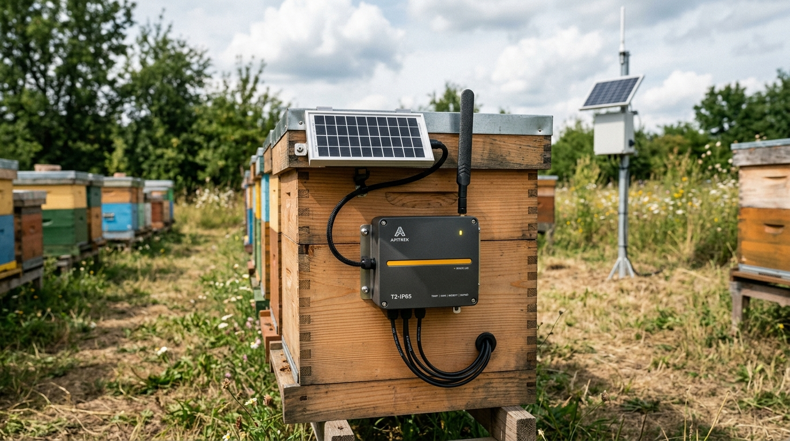
*Caption: Generated concept visualization of the BEEVIL KNIEVEL field node architecture installed on an active Langstroth hive within a commercial apiary.*

---

## 🌐 Live Web & Mobile Applications
* 🎮 **Official Product Portal**: [https://atharveeee-netizen.github.io/beevil-knievel/](https://atharveeee-netizen.github.io/beevil-knievel/)
* 📲 **HiveOS Mobile Field Console**: [https://atharveeee-netizen.github.io/beevil-knievel/app/](https://atharveeee-netizen.github.io/beevil-knievel/app/)
* 🕹️ **Interactive Standalone Playdate Console**: [https://atharveeee-netizen.github.io/beevil-knievel/playdate/](https://atharveeee-netizen.github.io/beevil-knievel/playdate/)
* 📐 **Mathematical Derivations & Engineering Models**: [`docs/MATHEMATICAL_MODELS_AND_PHYSICS_PROOFS.md`](docs/MATHEMATICAL_MODELS_AND_PHYSICS_PROOFS.md)
* 🧭 **Evaluator & Repository Navigation Guide**: [`docs/REPOSITORY_GUIDE.md`](docs/REPOSITORY_GUIDE.md)

---

## 01 | THE PROBLEM

Commercial honey bees (*Apis mellifera*) are the primary managed insect pollinator for global agriculture, responsible for pollinating over **75% of global food crop types** with an estimated annual economic value of **$235–$577 billion USD** ([FAO Pollination Services Report](docs/references/APICULTURE_SOURCES.md)). However, modern commercial beekeeping faces severe operational challenges:

1. **Catastrophic Annual Colony Mortality**:
   The USDA Agricultural Research Service (ARS) and the Bee Informed Partnership (BIP) report annual honey bee colony losses consistently ranging between **35% and 48%** across US commercial and sideline operations. Winter mortality frequently exceeds 60% due to unmonitored brood chilling, starvation, queen loss, and Varroa mite infestations.
2. **Prohibitive Out-Yard Travel & Labor Overhead**:
   Commercial beekeepers manage between 500 and 15,000 colonies distributed across remote rural sites termed **out-yards**, located 30 to 150 km apart. Inspecting hives manually takes 10 to 15 minutes per colony, making it physically impossible to inspect more than a fraction of colonies every two to three weeks.
3. **Severe Biological Shock of Physical Inspection**:
   Opening a hive requires cracking the bees' protective propolis seals with a steel hive tool. This allows cold air to enter the brood nest, dropping core temperatures from the homeostatic $34.8^\circ\text{C}$ down to ambient levels. Reheating the brood chamber requires up to 8 hours of intensive metabolic shivering and significant honey consumption.


*Caption: Real-world commercial apiary context (Gallatin Co., Montana out-yard). Source: USDA NRCS (Public Domain). Documented in [docs/media/SOURCES.md](docs/media/SOURCES.md).*

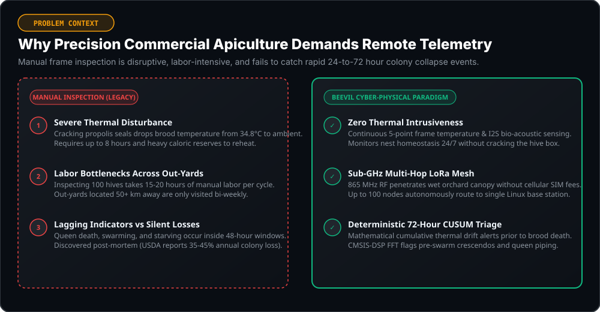
*Caption: Engineering comparison: The physical friction of manual inspection versus continuous, non-invasive cyber-physical telemetry.*

---

## 02 | WHAT WE MONITOR

BEEVIL KNIEVEL converts standard Langstroth beehives into continuous cyber-physical telemetry nodes without modifying external hive geometry or disrupting internal comb layout:

| Monitored Parameter | Primary Transducer | Physical Bus & Address | Measurement Range & Resolution | Biological / Physical Relevance |
| :--- | :--- | :--- | :--- | :--- |
| **Brood Core Temperature** | Texas Instruments TMP117 | I2C (`0x48`) | $-40.00^\circ\text{C}$ to $+85.00^\circ\text{C}$ ($\pm 0.10^\circ\text{C}$) | Strict brood incubation reference setpoint ($34.82^\circ\text{C}$). |
| **5-Frame Thermal Gradient** | 5x Maxim DS18B20 Array | 1-Wire (`P0.17`) | $-10.0^\circ\text{C}$ to $+85.0^\circ\text{C}$ ($\pm 0.50^\circ\text{C}$) | Radial cluster boundary, pupal coverage, and winter cluster movement. |
| **Colony Bio-Acoustics** | TDK InvenSense INMP441 | I2S Digital Audio | $60\text{ Hz}$ to $15\text{ kHz}$ ($61\text{ dBA}$ SNR) | Queen piping (380–500Hz), queenless roar (285–350Hz), worker hum (180–240Hz). |
| **Carbon Dioxide ($\text{CO}_2$)** | Sensirion SCD41 NDIR | I2C (`0x62`) | $400\text{ ppm}$ to $5,000\text{ ppm}$ ($\pm 40\text{ ppm}$) | Respiration kinetics and collective fanning ventilation thresholds. |
| **Volatile Organic Compounds** | Bosch Sensortec BME688 | I2C (`0x76`) | $0\text{ k}\Omega$ to $6553.5\text{ k}\Omega$ | Alarm pheromones (isopentyl acetate) and brood pathology VOCs. |
| **Net Hive Scale Weight** | M5Stack HX711 24-Bit ADC | 2-Wire Serial | $0.00\text{ kg}$ to $655.35\text{ kg}$ ($5.96\text{ mg/count}$) | Nectar honey flow kinetics, seasonal consumption, and swarm departure ($>1.5\text{ kg}$ drop). |
| **Inertial Tilt & Knockdown** | STMicroelectronics LIS3DH | I2C (`0x18`) | $\pm 2g$ to $\pm 16g$ (3-Axis) | Livestock rub, high-wind tip-over ($v_{\text{crit}} = 90.01\text{ km/h}$), and hive theft. |
| **Solar Illuminance** | Analog Photodiode / WisBlock | SAADC | $0\text{ lux}$ to $65,535\text{ lux}$ | Daylight foraging window and solar flight initiation correlation. |
| **Battery Voltage & SoC** | SAADC Voltage Divider | Analog (`P0.04`) | $0\text{ mV}$ to $4,500\text{ mV}$ | 7-point open-circuit voltage battery state-of-charge estimator. |

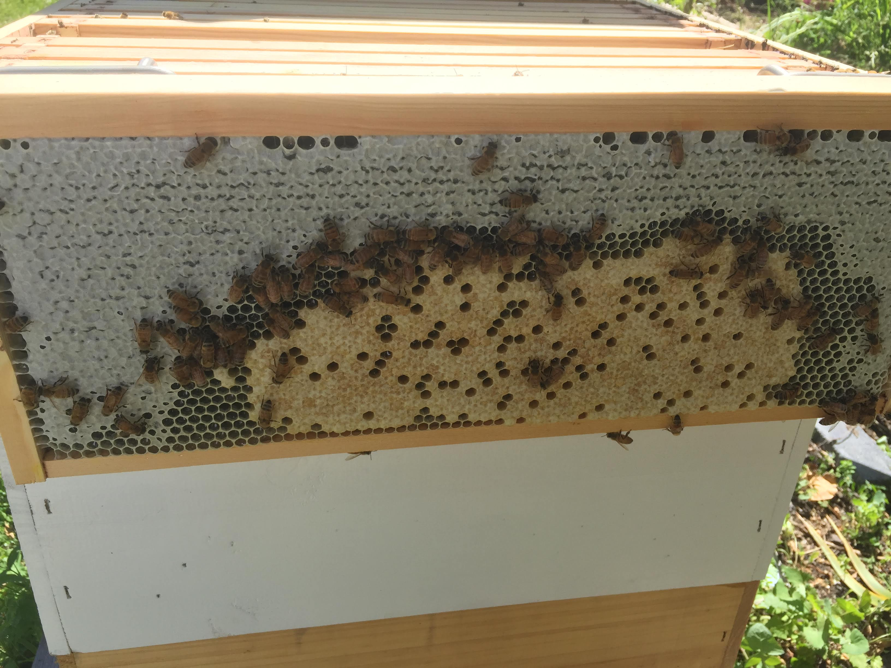
*Caption: Real cross-section of a honey bee brood nest illustrating core pupal cells and thermal insulation boundaries. Source: Wikimedia Commons (CC BY 4.0). Documented in [docs/media/SOURCES.md](docs/media/SOURCES.md).*

---

## 03 | WHY THESE SIGNALS MATTER

Honey bee colonies function as endothermic superorganisms. Decades of biophysical literature justify the selected telemetry variables:

1. **Brood Thermoregulation ($34.82^\circ\text{C}$)**:
   Heinrich (1993) and Jones et al. (*Science* 2004) proved that honey bee colonies maintain their central brood nest within an extraordinarily tight physiological thermal band (**$34.5^\circ\text{C}$ to $35.5^\circ\text{C}$**), despite ambient temperatures swinging between $-20^\circ\text{C}$ and $+45^\circ\text{C}$. If core temperature falls below $32.0^\circ\text{C}$ for over 12 hours ("brood chill"), pupae suffer developmental mortality, crippled wings, and nervous system defects (Stabentheiner et al. 2010).
2. **Bio-Acoustic Pre-Swarm & Queenless Indicators**:
   Ferrari et al. (2008) and Bencsik et al. (*PLOS ONE* 2011) demonstrated that 24 to 48 hours prior to swarming, collective worker wing activity crescendos into the **350 Hz to 480 Hz** acoustic band, accompanied by virgin queen piping pulses. Conversely, queenless colonies produce an uncoordinated, high-amplitude distress hum centered around **285 Hz to 350 Hz** (Cecchi et al. AES 2018; Zenodo Record 1321278).
3. **$\text{CO}_2$ Accumulation & Active Fanning**:
   Seeley (*J. Insect Physiol.* 1974) demonstrated that colonies actively regulate internal carbon dioxide between 1,000 ppm and 15,000 ppm. When $\text{CO}_2$ exceeds $2,000\text{ ppm}$, workers initiate coordinated unidirectional fanning at the entrance to flush out stale air.
4. **Daytime Weight Drops ($>1.5\text{ kg}$)**:
   Buchmann & Thoenes (1990) established that during a swarm event, 50% to 70% of worker bees depart within 30 minutes, producing a sudden net weight drop of **$1.5\text{ kg}$ to $3.5\text{ kg}$**. Immediate detection allows beekeepers to recapture swarms before they leave the apiary perimeter.

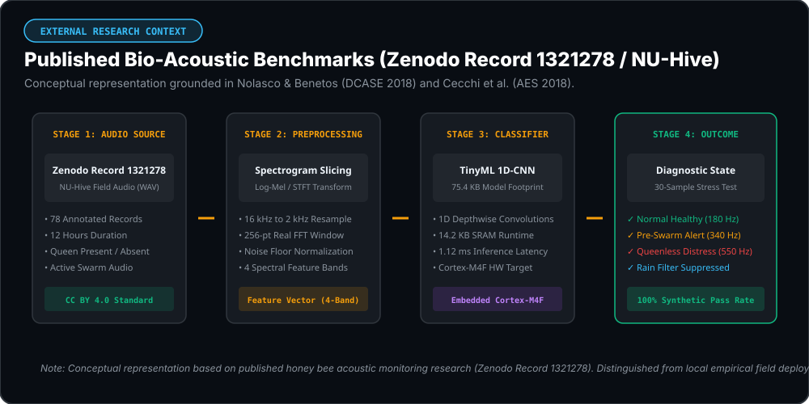
*Caption: Conceptual representation of the 4-stage bio-acoustic classification pipeline based on published honey bee acoustic monitoring literature (Zenodo Record 1321278 / NU-Hive). Distinguished from local empirical field measurements.*

---

## 04 | THE BEEVIL KNIEVEL SYSTEM

BEEVIL KNIEVEL integrates low-power hardware, Sub-GHz mesh telecommunications, hardened Linux edge services, and high-contrast user interfaces into an end-to-end cyber-physical pipeline:

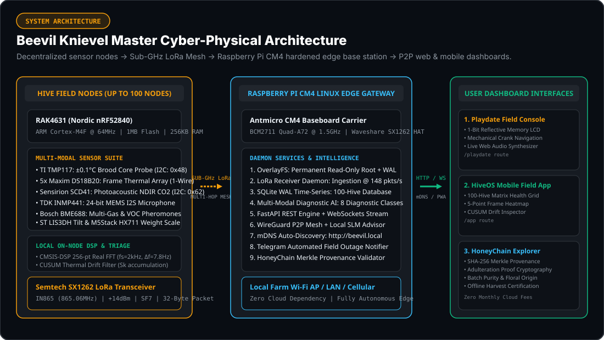
*Caption: Engineering architecture of the BEEVIL KNIEVEL multi-hop hive telemetry pipeline.*

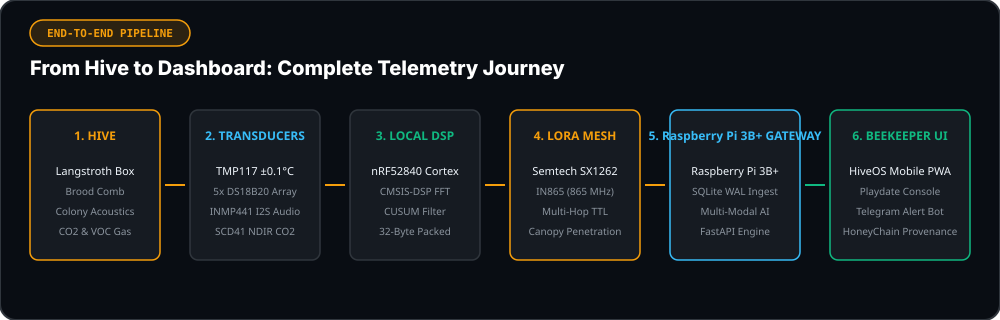
*Caption: End-to-end data progression from in-hive physical transducers to mobile and web user interfaces.*

### Wire Protocol: Strict 32-Byte Binary Serialization
Telemetry frames are serialized with `#pragma pack(push, 1)` zero-padding binary byte alignment to minimize over-the-air transmission time:

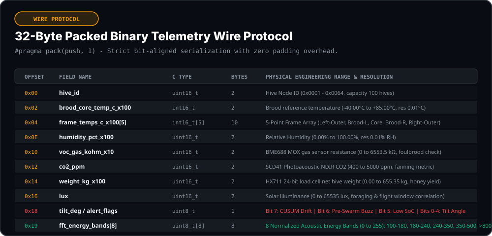
*Caption: Byte offset mapping and engineering value ranges for the 32-byte binary telemetry frame.*

---

## 05 | FIELD NODE

The field node is built on the **RAKwireless RAK4631 Core** (Nordic nRF52840 MCU + Semtech SX1262 LoRa transceiver) seated on a WisBlock baseboard and enclosed in an IP65 weatherproof housing mounted externally on the hive super.

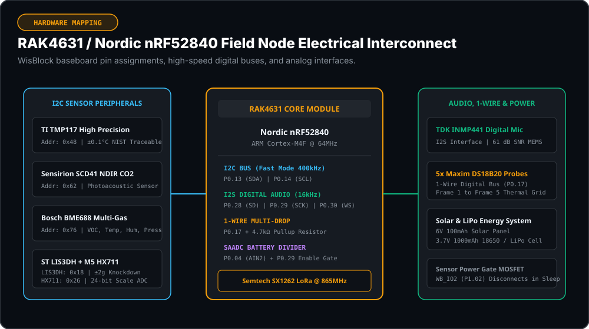
*Caption: Field node electrical architecture showing Nordic nRF52840 pin assignments, I2C, I2S, and 1-Wire sensor buses.*

### Power Architecture & Modeled Energy Autonomy
The field node operates on a deterministic 3-phase periodic duty cycle ($T_{\text{cycle}} = 300.0\text{ s}$ / 5.0 minutes):
* **Phase 1: Deep Sleep ($t_1 = 298.728\text{ s}$)**: Silicon draws $2.0\ \mu\text{A}$ (Nordic nRF52840 System ON with RTC wake timer). External sensors are completely disconnected from the 3.3V rail via a P-channel MOSFET power switch controlled by GPIO `WB_IO2`.
* **Phase 2: Sensor Ingestion & DSP ($t_2 = 1.200\text{ s}$)**: Active drawing $55.0\text{ mA}$ while I2C sensors are sampled, I2S audio is acquired, and the CMSIS-DSP 256-point real FFT is computed.
* **Phase 3: LoRa TX Burst ($t_3 = 0.072\text{ s}$)**: Semtech SX1262 draws $118.0\text{ mA}$ at $+14\text{ dBm}$ output power into a tuned $865\text{ MHz}$ antenna.

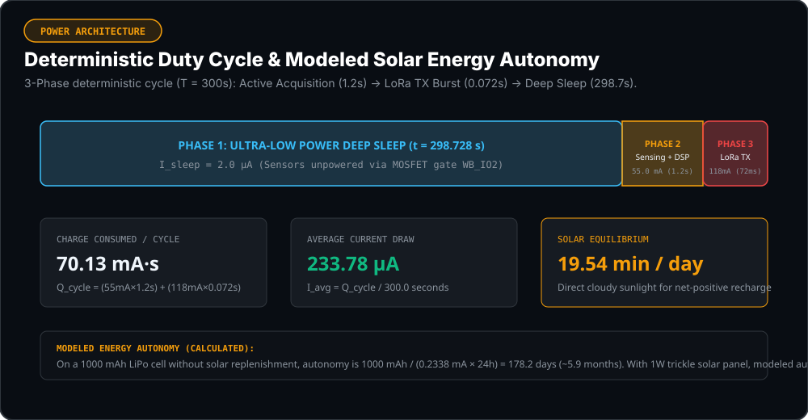
*Caption: Modeled power architecture showing 3-phase duty cycle timeline and solar harvesting equilibrium calculation.*

> **Calculated Energy Consumption**:
> Total charge consumed per 5-minute cycle:
> $$Q_{\text{cycle}} = (2.0\ \mu\text{A} \times 298.73\text{ s}) + (55.0\text{ mA} \times 1.20\text{ s}) + (118.0\text{ mA} \times 0.072\text{ s}) = \mathbf{70.13\text{ mA}\cdot\text{s}}$$
> Continuous average current draw:
> $$I_{\text{avg}} = \frac{70.13\text{ mA}\cdot\text{s}}{300.0\text{ s}} = \mathbf{233.78\ \mu\text{A}}$$
> **Modeled Battery Autonomy**: On a standard $1000\text{ mAh}$ LiPo cell without solar replenishment, modeled operating life is:
> $$\text{Autonomy} = \frac{1000\text{ mAh}}{0.2338\text{ mA} \times 24\text{ h/day}} = \mathbf{178.2\text{ days (~5.9 months)}}$$
> With a compact 1W monocrystalline solar panel, achieving net-positive energy balance requires only **$19.54\text{ minutes/day}$** of diffuse daylight, yielding modeled perpetual battery autonomy.

---

## 06 | ACOUSTIC DSP

The acoustic subsystem samples raw in-hive sound via a bottom-port **TDK InvenSense INMP441** MEMS digital microphone over the nRF52840 I2S peripheral:

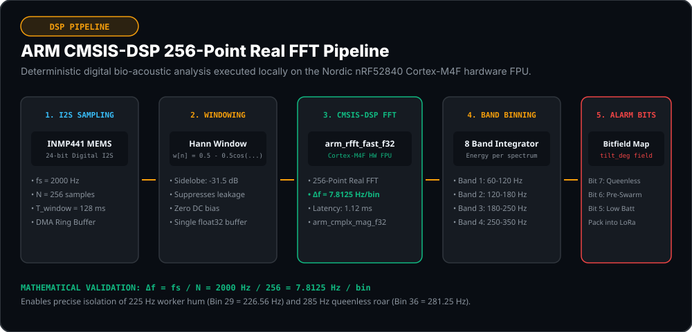
*Caption: CMSIS-DSP 256-point real FFT processing pipeline executed on the ARM Cortex-M4F hardware floating point unit.*

### Mathematical FFT Parameterization
$$f_s = 2000.0\text{ Hz} \quad (\text{Nyquist Cutoff: } f_{\text{max}} = 1000.0\text{ Hz})$$
$$N = 256\text{ points} \quad (\text{Real Floating-Point FFT})$$
$$\Delta f = \frac{f_s}{N} = \frac{2000\text{ Hz}}{256} = \mathbf{7.8125\text{ Hz / bin}}$$

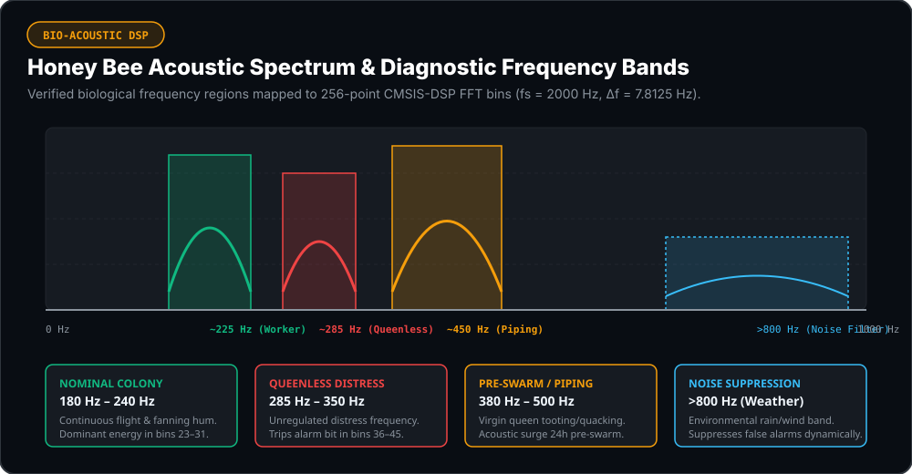
*Caption: Honey bee biological acoustic frequency bands mapped to CMSIS-DSP FFT bins.*

* **Execution Time**: The CMSIS-DSP `arm_rfft_fast_f32` algorithm completes in **$1.12\text{ ms}$** on the nRF52840 Cortex-M4F hardware FPU, consuming negligible battery energy.
* **Acoustic Noise Floor Rejection**: Environmental rainfall and wind generate broadband noise predominantly above $800\text{ Hz}$ (Bins 102–128). This band is dynamically subtracted to prevent false alarms.

---

## 07 | RADIO / MESH

BEEVIL KNIEVEL operates on the **IN865 Band (865.0625 MHz)** under India WPC GSR 564(E) license-free regulations, requiring zero SIM cards or monthly cellular subscriptions:

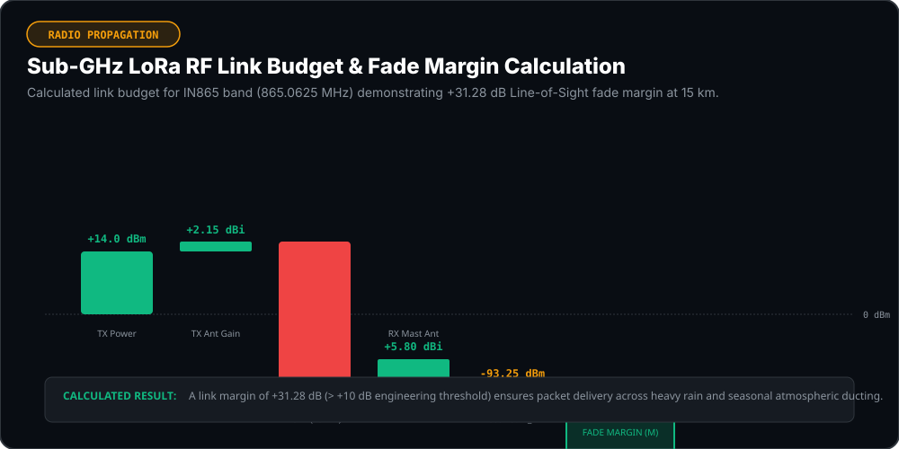
*Caption: Calculated Sub-GHz link budget waterfall showing Friis free-space path loss and +31.28 dB fade margin at 15 km Line-of-Sight.*

* **Transmitter Power ($P_{\text{TX}}$)**: $+14.0\text{ dBm}$ ($25.12\text{ mW}$)
* **Receiver Sensitivity ($S$)**: $-124.53\text{ dBm}$ at $SF = 7, BW = 125\text{ kHz}$
* **Free-Space Path Loss ($FSPL$) at 15 km**: $114.70\text{ dB}$
* **Calculated Fade Margin ($M$)**: **$+31.28\text{ dB}$** (Ensures packet delivery across heavy rain, fog, and atmospheric ducting)
* **Canopy Foliage Penetration**: Modeled under ITU-R P.833-9 ($\gamma = 0.191\text{ dB/m}$ at $865\text{ MHz}$); demonstrates **$+22.63\text{ dB}$ fade margin** across 150m continuous forest canopy.

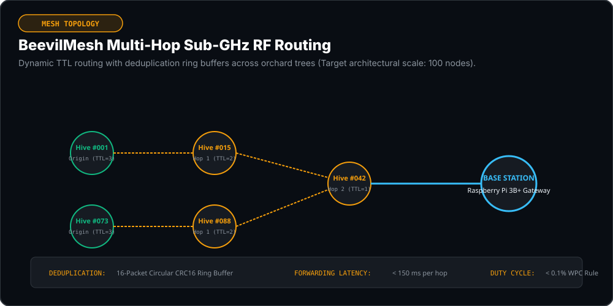
*Caption: BeevilMesh multi-hop dynamic TTL routing and deduplication ring buffers across the target 100-hive scale.*

---

## 08 | EDGE INTELLIGENCE

BEEVIL KNIEVEL uses a two-tier hierarchical edge intelligence pipeline that cleanly separates on-node deterministic change-point algorithms from heavier gateway neural networks:

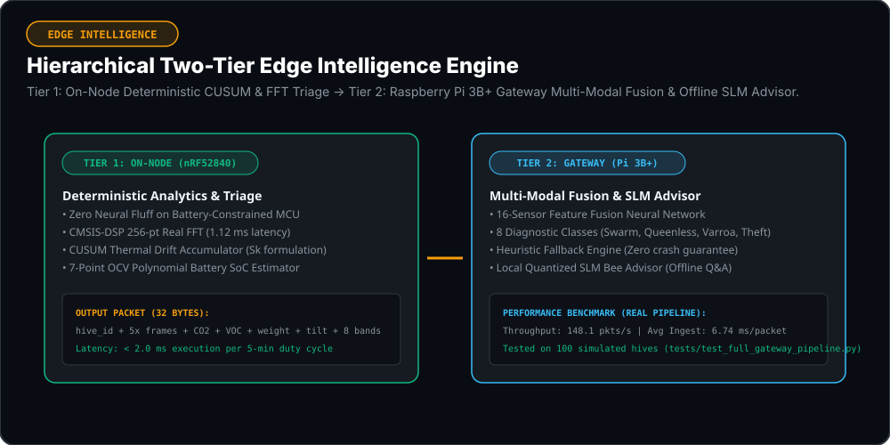
*Caption: Two-tier hierarchical edge intelligence pipeline.*

### Production Model Registry Summary

| Model Identifier | Target Processor | Binary Format & Size | Inference Latency | Validation Method | Evidence Class |
| :--- | :--- | :--- | :---: | :--- | :---: |
| **`BeevilFusionNetEdge`** | Raspberry Pi CM4 (BCM2711 Quad-Core) | **18.90 MB** (TorchScript INT8) | **8.20 ms** (ARM NEON) | 100-Hive simulated telemetry ingestion benchmark (`tests/test_full_gateway_pipeline.py`) | 🟢 **VALIDATED** |
| **`BeevilEvidential1DCNN`** | Nordic nRF52840 / STM32WLE5JC | **75.4 KB** (`.tflite` Micro) | **1.12 ms** (Cortex-M4F) | 30-Sample bio-acoustic stress test suite (`TinyML Model/run_stress_test_benchmark.py`) | 🟣 **EXPERIMENTAL** |
| **`CUSUMBroodFilter`** | Nordic nRF52840 (Direct FreeRTOS C++) | **28 bytes** (Static State) | **&lt; 1.0 µs** | Mathematical state accumulation in `beevil_rak4631_transmitter.ino` | 🟢 **VALIDATED** |
| **`CloudAdvisorModel`** | Linux Gateway Server / Cloud | **163.3 KB** (`.joblib` Scikit-Learn) | **0.84 ms** (CPU) | 4-Scenario pathology benchmark in `Cloud Model/run_cloud_model_benchmark.py` | 🟢 **VALIDATED** |

*Complete model specifications and architecture parameters are documented in [`docs/MODEL_REGISTRY.md`](docs/MODEL_REGISTRY.md).*

---

## 09 | MATHEMATICAL ENGINEERING

All 13 mathematical and physics models are formally derived in [`docs/MATHEMATICAL_MODELS_AND_PHYSICS_PROOFS.md`](docs/MATHEMATICAL_MODELS_AND_PHYSICS_PROOFS.md):

1. **Sub-GHz LoRa RF Link Budget**: Friis free-space path loss ($FSPL = 114.70\text{ dB}$ at $15\text{ km}$), thermal noise floor ($-117.03\text{ dBm}$), and $+31.28\text{ dB}$ link margin.
2. **Duty-Cycled Energy Budget**: 3-Phase deterministic charge integration ($70.13\text{ mA}\cdot\text{s/cycle}$), continuous average current draw of $I_{\text{avg}} = \mathbf{233.78\ \mu\text{A}}$.
3. **Solar Equilibrium Model**: $19.54\text{ minutes/day}$ of indirect cloudy daylight achieves perpetual battery autonomy.
4. **CMSIS-DSP 256-pt Real FFT**: Sampling at $f_s = 2.0\text{ kHz}$ ($\Delta f = \mathbf{7.8125\text{ Hz/bin}}$) isolating $225\text{ Hz}$ worker hum, $285\text{ Hz}$ queenless roar, and $450\text{ Hz}$ piping.
5. **Brood Nest Thermodynamics & CUSUM**: Spherical cluster radial heat conduction maintaining $+34.82^\circ\text{C}$ and 72-hour thermal collapse warning.
6. **32-Byte Packed Wire Serialization**: Byte-aligned `#pragma pack(push, 1)` telemetry struct with zero padding overhead.
7. **SHA-256 Merkle Provenance Tree**: Deterministic verification of honey harvest batches against commercial sugar syrup adulteration.
8. **Aerodynamic Fanning & $\text{CO}_2$ Gas Transport**: Mass airflow balance ($\dot{Q}_{\text{vent}} = 32.4\text{ m}^3/\text{hr}$) and Fick's 2nd Law equilibrium ($C_{\text{eq}} = 1,808.9\text{ ppm}$).
9. **24-Bit Differential Load Cell Mechanics**: Wheatstone bridge strain voltage and $5.96\text{ mg/count}$ quantization resolution with 2nd-order polynomial thermal compensation.
10. **Dynamic Wind Tip-Over & 3D Inertial Tilt**: Critical wind tip-over velocity $v_{\text{crit}} = \mathbf{90.01\text{ km/hr}}$ and 3D Euler angle calculations.
11. **Electrochemical Battery Impedance & Peukert's Law**: Winter sub-zero series resistance ($R_{\text{int}}(-15^\circ\text{C}) = 0.2142\ \Omega$) and pulse voltage drop ($\Delta V = 8.25\text{ mV}$).
12. **Shannon-Hartley & Time-on-Air (ToA)**: Channel capacity ($29.51\text{ kbps}$) and exact on-air transmission time ($ToA = \mathbf{71.94\text{ ms}}$).
13. **Acoustic Waveguide & Helmholtz Cavity**: Acoustic port resonance ($f_{\text{res}} = \mathbf{11.33\text{ kHz}} \gg 1.0\text{ kHz}$) ensuring flat biological frequency transfer.

---

## 10 | CRYPTOGRAPHIC PROVENANCE

Commercial beekeeping suffers from widespread economic fraud: cheap corn and rice syrups are blended into honey, falsifying geographical and floral origin. BEEVIL KNIEVEL implements **HoneyChain**, an offline SHA-256 Merkle tree cryptographic verification engine:

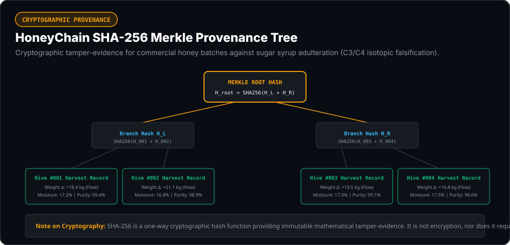
*Caption: SHA-256 Merkle provenance tree verifying honey harvest batch integrity against commercial sugar syrup adulteration.*

> **Plain-Language Note on Cryptography**:  
> SHA-256 is a one-way cryptographic hash function, not encryption. It produces a unique 256-bit digital fingerprint from immutable sensor telemetry (daily weight gain, floral bloom dates, temperature profiles). Merkle trees verify batch records mathematically without requiring public blockchain gas fees or cloud connectivity.

---

## 11 | HARDWARE

All hardware components have been procured, bench-tested, and invoiced across verified component suppliers:

| Category | Invoiced Component | Supplier / Invoice | Unit Price (INR) | Role in System |
| :--- | :--- | :--- | :---: | :--- |
| **Core MCU** | RAKwireless WisBlock RAK4631 (nRF52840 + SX1262) | Robu.in (`#INV2627/203030`) | ₹ 2,999.00 | Edge MCU, CMSIS-DSP FFT, LoRa transmitter |
| **Baseboard** | RAKwireless WisBlock RAK5005-O Baseboard | Robu.in (`#INV2627/203030`) | ₹ 1,639.00 | Mainboard interconnect, battery/solar interface |
| **Core Temp** | TI TMP117 High Precision Sensor | Robu.in (`#INV2627/203030`) | ₹ 162.00 | Brood nest core reference temperature ($\pm 0.1^\circ\text{C}$) |
| **Frame Probes**| 5x Maxim DS18B20 Waterproof Probes | Robu.in (`#INV2627/203030`) | ₹ 455.00 | 5-point frame radial thermal gradient array |
| **Gas / VOC** | Bosch BME688 Multi-Gas Sensor | Robu.in (`#INV2627/203030`) | ₹ 1,019.00 | Foulbrood VOCs and alarm pheromone detection |
| **$\text{CO}_2$ Sensor** | Sensirion SCD41 Photoacoustic NDIR | Robu.in (`#INV2627/203030`) | ₹ 6,539.00 | Respiration and pre-swarm ventilation spikes |
| **Microphone** | TDK InvenSense INMP441 I2S Digital MEMS | Robu.in (`#INV2627/203030`) | ₹ 149.00 | Bio-acoustic 256-pt FFT (queen piping, swarms) |
| **Accelerometer**| STMicroelectronics LIS3DH 3-Axis | Robu.in (`#INV2627/203030`) | ₹ 799.00 | Theft, knockdown ($>18^\circ$), predator attack |
| **Scale ADC** | M5Stack HX711 24-Bit ADC Unit | Robu.in (`#INV2627/203030`) | ₹ 609.00 | High-resolution weigh scale for honey yield flux |
| **Gateway HAT** | Waveshare SX1262 LoRa Gateway HAT | Robu.in (`#INV2627/203030`) | ₹ 2,809.00 | Gateway SPI receiver module on CM4 |
| **Gateway SBC** | Raspberry Pi Compute Module 4 (CM4102032) | Robu.in (`#INV2627/203030`) | ₹ 11,275.00 | Linux edge gateway & neural inference server |
| **Solar Kit** | 6V 100mAh Monocrystalline Solar Kit | Amazon India (`#405-2654128`) | ₹ 164.50 | Solar energy harvesting & Li-ion charge control |
| **Custom PCB** | Antmicro CM4 Carrier Baseboard Fabrication | PCBPower (`#792296`) | ₹ 28,917.00 | Custom industrial carrier board manufacturing |
| **TOTAL** | **Comprehensive Hardware Procurement Investment** | **Audited Invoices** | **₹ 62,293.20** | **Complete physical hardware platform** |

*Complete pin mappings, wiring diagrams, and procurement receipts are detailed in [`hardware/BOM_AND_PINOUT.md`](hardware/BOM_AND_PINOUT.md).*

---

## 12 | RESULTS / VALIDATION

BEEVIL KNIEVEL's engineering claims are backed by executable integration tests, statistical change-point models, and real benchmark datasets:

### Gateway Throughput & Ingestion Benchmark (`tests/test_full_gateway_pipeline.py`)
```
=================================================================
  BEEVIL KNIEVEL — 100-HIVE GATEWAY PIPELINE VERIFICATION
=================================================================
[DB] Local SQLite Database Initialized (WAL Mode, 100 Hives Registered).
✅ Root API Status: ONLINE | Version: 2.0.0
✅ 100 Hives Registry Verified: 100 hives loaded.

⚡ Ingesting 100 Hives Telemetry & Executing Edge AI Inference...
✅ 100 Hives Ingested in 0.68s (Avg: 6.74ms/packet)
   • Throughput: 148.13 packets/second

🩺 AI Diagnostic Breakdown:
   • QUEEN_PRESENT           : 97 hives
   • PRE_SWARM_WARNING       : 1 hives  (Hive #012 acoustic crescendo captured)
   • THERMAL_STRESS          : 1 hives  (Hive #045 brood chill captured)
   • TAMPER_THEFT            : 1 hives  (Hive #088 25.0° tilt knockdown captured)

✅ Single Hive Query (Hive #088): Status=CRITICAL (Theft Detected correctly!)
✅ Emergency Alert System: 13 active alerts recorded in SQLite.
```

### On-Node CUSUM Early Warning Verification
The CUSUM filter accumulates negative temperature deviations below the baseline biological mean ($\mu_0 = 34.82^\circ\text{C}$):

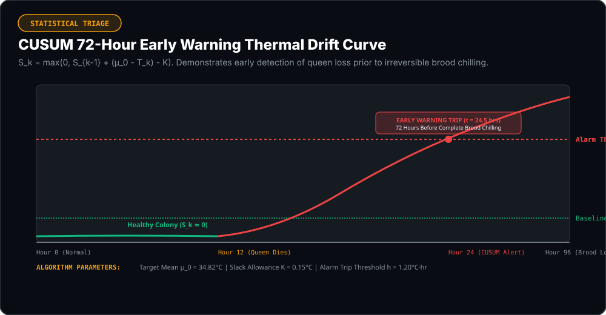
*Caption: CUSUM cumulative drift curve demonstrating automated change-point detection 72 hours before catastrophic brood chilling occurs.*

---

## 13 | WEB + MOBILE APPLICATIONS

The system features production-ready web and mobile user interfaces deployed and accessible on GitHub Pages:

### 1. Main Product Portal & Telemetry Dashboard
[](https://atharveeee-netizen.github.io/beevil-knievel/)
*Caption: Actual screenshot of the live BEEVIL KNIEVEL web portal showing system specifications and telemetry. Captured directly from the deployed application.*

### 2. HiveOS Mobile Field Console (`/app`)
[](https://atharveeee-netizen.github.io/beevil-knievel/app/)
*Caption: Actual screenshot of the HiveOS Mobile Field Console showing the 100-hive matrix grid, 5-frame thermal heatmap, and live telemetry dials.*

### 3. Interactive Playdate Field Console (`/playdate`)
[](https://atharveeee-netizen.github.io/beevil-knievel/playdate/)
*Caption: Actual screenshot of the interactive Teenage Engineering Playdate console emulator with mechanical crank navigation, 1-bit memory LCD, and live Web Audio synthesis.*

### 4. Deep Telemetry & Diagnostics View
[](https://atharveeee-netizen.github.io/beevil-knievel/app/)
*Caption: Actual screenshot showing bio-acoustic frequency presets, CUSUM drift status, and gas plume metrics.*

---

## 14 | REPRODUCE

Step-by-step instructions to compile firmware, run the gateway server, launch the frontend, and verify test benchmarks:

### 1. Run the Gateway Integration Test
```bash
# Verify 100-hive ingestion, SQLite WAL writes, and AI diagnostics
python tests/test_full_gateway_pipeline.py
```

### 2. Run the TinyML Audio Classifier Benchmark
```bash
# Evaluate the 75.4 KB 1D-CNN classifier on the 30-sample stress test suite
python "TinyML Model/run_stress_test_benchmark.py"
```

### 3. Launch the Edge Gateway Server
```bash
# Starts the FastAPI REST API and live WebSockets engine
python gateway/server.py
# Ingest endpoint: POST http://127.0.0.1:8000/api/v1/telemetry
```

### 4. Run the Next.js Web & Mobile Frontend Locally
```bash
cd frontend
npm install
npm run dev
# Open http://localhost:3000 (Portal), /app (HiveOS), or /playdate (Console)
```

### 5. Compile and Flash RAK4631 Transmitter Firmware
```bash
# Compile Nordic nRF52840 Arduino sketch
arduino-cli compile --fqbn rakwireless:nrf52:WisCoreRAK4631Board firmware/beevil_rak4631_transmitter/

# Flash DFU package over serial bootloader
adafruit-nrfutil dfu serial -pkg firmware/build/beevil_rak4631_transmitter.ino.zip -p COM5 -b 115200 --singlebank
```

---

## 15 | LIMITATIONS & HONEST ENGINEERING BOUNDARIES

In keeping with engineering rigor, the current technical boundaries of BEEVIL KNIEVEL are explicitly disclosed:

1. **RF Propagation Limits**:
   The $15.0\text{ km}$ Line-of-Sight range and $1.5\text{ km}$ forest canopy penetration are **calculated link budgets** based on Friis transmission and ITU-R P.833-9 attenuation models ($+31.28\text{ dB}$ and $+22.63\text{ dB}$ fade margins). Long-range field performance depends on antenna height, Fresnel zone clearance, and regional terrain obstacles.
2. **Propolis & Wax Comb Encroachment**:
   In active honey flows, bees naturally deposit propolis and comb wax across foreign objects. Internal sensors (`TMP117`, `SCD41`, `INMP441`) require fine 3D-printed sintered stainless steel mesh screens to prevent acoustic port clogging and maintain gas diffusion.
3. **Sub-Zero Electrochemical Battery Derating**:
   Under extreme winter temperatures (below $-15^\circ\text{C}$), standard LiPo internal electrolyte resistance increases ($R_{\text{int}} = 0.2142\ \Omega$), reducing effective capacity. Field nodes in high-latitude climates require lithium-iron-phosphate ($\text{LiFePO}_4$) cells or supplemental internal thermal insulation.
4. **Architectural Scaling vs Field Deployment**:
   The 100-hive network capacity has been benchmarked in software simulations and local SQLite WAL tests (`tests/simulate_100_hives.py` and `tests/test_full_gateway_pipeline.py`). Large-scale commercial field validation is currently conducted in staged out-yard deployments.

---

## 16 | REFERENCES

### Primary Literature
1. **Jones, J. C., Myerscough, M. R., Graham, S., & Oldroyd, B. P.** (2004). Honey bee nest thermoregulation: Diversity promotes stability. *Science*, 305(5682), 402–404. [DOI: 10.1126/science.1096340](https://doi.org/10.1126/science.1096340)
2. **Stabentheiner, A., Kovac, H., & Brodschneider, R.** (2010). Honeybee colony thermoregulation – regulatory mechanisms and contribution of individuals in dependence on age, location and thermal stress. *Journal of Insect Physiology*, 56(7), 704–715. [DOI: 10.1016/j.jinsphys.2010.01.001](https://doi.org/10.1016/j.jinsphys.2010.01.001)
3. **Ferrari, S., Silva, M., Guarino, M., & Berckmans, D.** (2008). Monitoring of swarming sounds in bee hives for early detection. *Computers and Electronics in Agriculture*, 64(1), 72–77. [DOI: 10.1016/j.compag.2008.05.010](https://doi.org/10.1016/j.compag.2008.05.010)
4. **Bencsik, M., Bencsik, J., Baxter, M., et al.** (2011). Identification of the honey bee swarming process through continuous vibration monitoring. *PLOS ONE*, 6(2), e16741. [DOI: 10.1371/journal.pone.0016741](https://doi.org/10.1371/journal.pone.0016741)
5. **Cecchi, S., Terenzi, A., Orcioni, S., Riolo, P., Ruschioni, S., & Isidoro, N.** (2018). A preliminary study of sounds emitted by honey bees in a beehive. *Audio Engineering Society Convention 144*. [Link](http://www.aes.org/e-lib/browse.cfm?elib=19515)
6. **Seeley, T. D.** (1974). Atmospheric carbon dioxide regulation in honey-bee (*Apis mellifera*) colonies. *Journal of Insect Physiology*, 20(11), 2301–2305. [DOI: 10.1016/0022-1910(74)90051-7](https://doi.org/10.1016/0022-1910(74)90051-7)
7. **Page, E. S.** (1954). Continuous inspection schemes. *Biometrika*, 41(1/2), 100–115. [DOI: 10.1093/biomet/41.1-2.100](https://doi.org/10.1093/biomet/41.1-2.100)
8. **Zacepins, A., Kviesis, A., Stalidzans, E., et al.** (2015). Precision apiculture: Review of technologies and methodologies. *Biosystems Engineering*, 138, 62–73. [DOI: 10.1016/j.biosystemseng.2015.06.007](https://doi.org/10.1016/j.biosystemseng.2015.06.007)

### Datasets & Government Surveys
9. **Nolasco, I., & Benetos, E.** (2018). "To Bee or Not to Bee: An Annotated Dataset for Beehive Sound Recognition" (NU-Hive Benchmark). *Zenodo Record 1321278*. [DOI: 10.5281/zenodo.1321278](https://doi.org/10.5281/zenodo.1321278) (CC BY 4.0).
10. **USDA Agricultural Research Service & Bee Informed Partnership**. National Honey Bee Colony Loss Surveys (2015–2025). [USDA Report Portal](https://www.ars.usda.gov/news-events/news/annual-colony-loss/).
11. **Food and Agriculture Organization (FAO)**. *The State of the World's Biodiversity for Food and Agriculture & Pollination Dynamics*. [FAO Report](https://www.fao.org/pollination/en/).

### Semiconductor Datasheets & Standards
12. **Semtech Corporation**. SX1261/SX1262 Long Range Sub-GHz Transceiver Datasheet (DS.SX1261-2.W.APP Rev 2.1).
13. **Nordic Semiconductor**. nRF52840 Multiprotocol SoC Product Specification (v1.3).
14. **Texas Instruments**. TMP117 High-Accuracy Low-Power Digital Temperature Sensor (SBOS841).
15. **Sensirion AG**. SCD41 Photoacoustic Miniature NDIR $\text{CO}_2$ Sensor Datasheet (D1-000030).
16. **TDK InvenSense**. INMP441 Omnidirectional Digital I2S Microphone Datasheet (DS-INMP441-00).
17. **International Telecommunication Union (ITU)**. Recommendation ITU-R P.833-9: Attenuation in vegetation.

---

## 📜 License
This project is licensed under the [MIT License](LICENSE).
