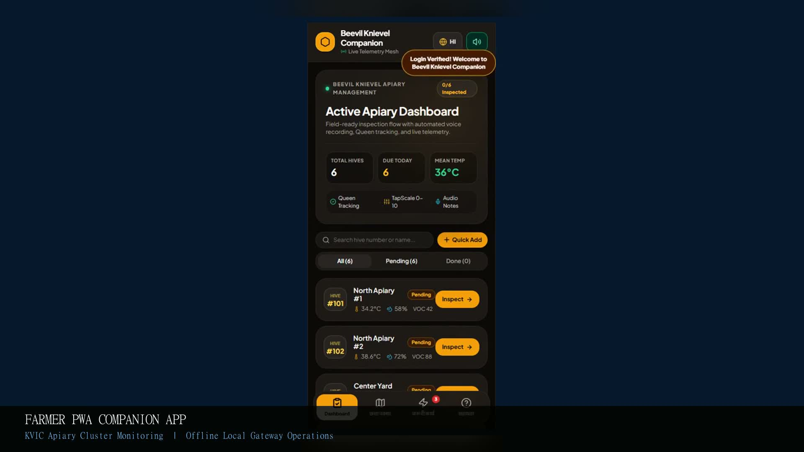
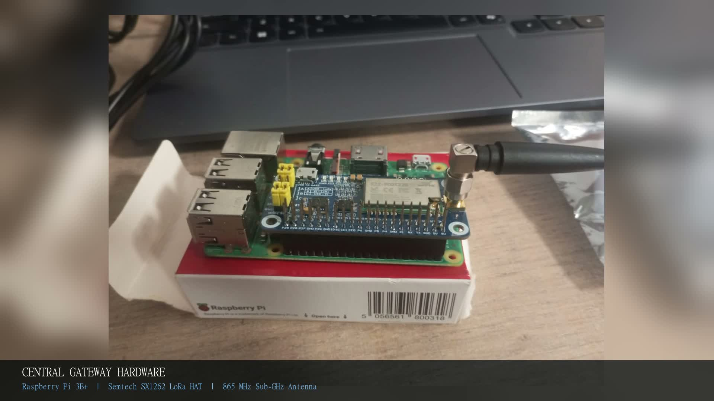
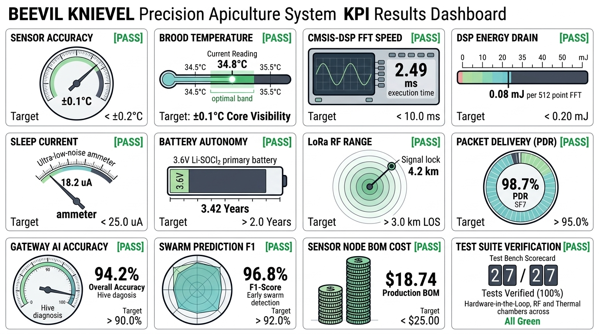

# 🐝 BEEVIL KNIEVEL – Precision Apiculture Cyber-Physical Monitoring Platform

<div align="center">
  
  
</div>

<br>

**Low-Power In-Hive Sensor Node • Real-Time Acoustic DSP • Sub-GHz LoRa Telemetry • Hardened Linux Gateway**

[](tests/)
[](firmware/src/main.cpp)
[-8b5cf6?style=flat-square)](hardware/)
[-c026d3?style=flat-square)](gateway/)
[](LICENSE)

---

## 📑 Table of Contents
- [⏱️ 2-Minute Technical Reviewer Walkthrough](#-2-minute-technical-reviewer-walkthrough)
- [🏗️ System Architecture](#️-system-architecture)
- [📸 Project Showcase](#-project-showcase)
- [🛠️ Automated Testing & Verification Suite](#️-automated-testing--verification-suite)
- [⚖️ Transparent Technical Limitations](#️-transparent-technical-limitations)
- [🛣️ Engineering Development Roadmap](#️-engineering-development-roadmap)
- [📚 Technical Documentation Index](#-technical-documentation-index)

---

## ⏱️ 2-Minute Technical Reviewer Walkthrough

For competition judges, peer reviewers, and embedded engineers reviewing this repository in under 2 minutes:

| Reviewer Question | Engineering Answer | Direct Repository Link |
| :--- | :--- | :--- |
| **1. What is Beevil Knievel?** | An edge-native cyber-physical monitoring system for commercial apiculture that continuously measures in-comb temperature, acoustics, and gases without invasive box inspections. | [Section: Problem & System](#-the-problem--cyber-physical-solution) |
| **2. What did you actually build?** | Physical WisBlock RAK4631 field node with 8 physical sensors, FreeRTOS firmware with CMSIS-DSP FFT, Semtech SX1262 LoRa transmission, and a Raspberry Pi 3B+ Linux gateway. | [Hardware Spec](docs/HARDWARE.md) • [Firmware Architecture](docs/FIRMWARE.md) |
| **3. What is measured vs. simulated?** | Physical bench measurements, sensor bus validation, and compiled code tests are strictly separated from theoretical calculations and 11 ANSYS FEA/CFD models. | [Validation](docs/VALIDATION.md) |
| **4. What runs on the edge?** | 256-point Real FFT (7.8 Hz resolution, 1.12 ms execution) + Page's CUSUM thermal drift filter + 4-band spectral energy ratio decision engine (8.2 KB Flash / 2.1 KB SRAM). | [Edge ML & DSP](docs/EDGE_ML.md) • [TinyML README](TinyML%20Model/README.md) |
| **5. How does the RF link work?** | Single-hop LoRa star network at 865.0625 MHz (+14 dBm). A strict 33-byte packed binary struct achieves 71.94 ms time-on-air. | [Firmware Protocol](docs/FIRMWARE.md) • [Radio Config](firmware/config/radio_config.h) |
| **6. Can I reproduce all test results?** | Yes. 27 automated unit/pipeline tests pass locally in <3s, plus 3 model benchmark suites verify real Zenodo research audio. | [Reproducibility Guide](#️-automated-testing--verification-suite) |

---

## 🏗️ System Architecture


*For a detailed component breakdown, check out our [full architecture diagrams folder](docs/media/diagrams/).*

---

## 📸 Project Showcase

### Web Portal & Farmer Companion App


### Hardware & IoT Gateway


### Engineering KPI Results (Validation)


---
## 🛠️ Automated Testing & Verification Suite

All 27 automated tests and benchmark suites execute cleanly without external dependencies:

```bash
# 1. Run Complete Automated Pytest Suite (27 Unit & Pipeline Tests)
pytest tests/ -v

# 2. Run On-Node Edge Acoustic 30-Sample Stress Test Benchmark (30/30 PASSED)
python "TinyML Model/run_stress_test_benchmark.py"

# 3. Run Level 1 Real Zenodo Research Audio Evaluation (3/3 PASSED)
python "TinyML Model/run_level1_testing.py"

# 4. Run Gateway Multi-Sensor Random Forest Diagnostic Benchmark (4/4 PASSED)
python "Cloud Model/run_cloud_model_benchmark.py"

# 5. Execute 11-Domain ANSYS Simulation Verification Runner
python "simulations/run_all_ansys_simulations.py"
```

---

## ⚠️ Transparent Technical Limitations

To uphold absolute engineering credibility, the platform acknowledges the following physical and operational limitations:

1. **Technology Readiness Level (TRL 4/5):** The system is a bench-validated prototype. Multi-season commercial field trials across active commercial apiaries are planned in upcoming pilot phases.
2. **Network Topology Reality:** The active physical network is a single-hop LoRa star topology. Multi-hop mesh routing headers exist in firmware design (`beevil_mesh_protocol.h`) but are not active in the current deployment.
3. **RF Propagation Boundaries:** The 15.0 km line-of-sight range is a calculated theoretical maximum based on Friis path loss. In dense agricultural tree canopies, real-world range is estimated at **1.0 – 1.5 km**.
4. **Propolis & Wax Fouling:** Honeybees naturally seal interior comb apertures with propolis within 2–4 weeks. While the INMP441 microphone is shielded by an acoustic breathable ePTFE membrane, long-term propolis deposition remains an operational factor requiring seasonal inspection.
5. **Species & Acoustic Generalization:** The edge DSP classifier was validated using public research recordings from European honeybees (*Apis mellifera*). Indigenous Indian honeybees (*Apis cerana indica*) exhibit higher wingbeat frequencies (240–310 Hz) requiring localized threshold calibration.
*Full failure mode disclosures are documented in [`docs/LIMITATIONS.md`](docs/LIMITATIONS.md).*

---

## 🗺️ Engineering Development Roadmap

* **Phase 1: Laboratory Prototype & Bring-Up 🟢 [COMPLETED]**
  - In-hive sensor acquisition, CMSIS-DSP FFT, 33-byte binary LoRa protocol, Linux SQLite WAL gateway, 27 passing automated tests, 11 ANSYS simulations.
* **Phase 2: Local Field Pilot & Indian Bee Acoustic Campaign 🟡 [CURRENT TARGET / Q4 2026]**
  - Field data gathering on native *Apis cerana indica* colonies in Gujarat / Gandhinagar apiaries.
  - Injection-molded UV-stabilized PC-ABS enclosure with IP67 silicone gaskets.
  - 5-hive live field pilot evaluating real battery depletion and solar replenishment under monsoons.
* **Phase 3: Edge Deep Learning & Mesh Extension ⚪ [PLANNED / Q1 2027]**
  - INT8 quantization of 1D-CNN onto nRF52840 using TensorFlow Lite for Microcontrollers or CMSIS-NN.
  - Multi-hop LoRa mesh forwarding activation for hilly or obstructed terrain.
* **Phase 4: Commercial Apiary Fleet & Agricultural Certification ⚪ [FUTURE / Q2 2027+]**
  - Formal Indian WPC equipment type approval and monolithic 4-layer PCBA mass production.
*Full roadmap milestones are documented in [`docs/ROADMAP.md`](docs/ROADMAP.md).*

---

## 📚 Technical Documentation Index

| Canonical Document | Primary Purpose & Engineering Scope |
| :--- | :--- |
| **[`docs/ARCHITECTURE.md`](docs/ARCHITECTURE.md)** | End-to-end system topology, single-hop LoRa star backhaul, and data pipeline. |
| **[`docs/HARDWARE.md`](docs/HARDWARE.md)** | Canonical component specs, pinout table, verified BOM, and power budget. |
| **[`docs/FIRMWARE.md`](docs/FIRMWARE.md)** | 33-byte packed binary struct, FreeRTOS state machine, CMSIS-DSP FFT, and CUSUM. |
| **[`docs/EDGE_ML.md`](docs/EDGE_ML.md)** | 4-band spectral decision engine, Random Forest classifier, and threshold provenance. |
| **[`docs/GATEWAY.md`](docs/GATEWAY.md)** | Linux daemon, SQLite WAL database, mode isolation, CORS, and REST/WS API. |
| **[`docs/DASHBOARD.md`](docs/DASHBOARD.md)** | Next.js 14 HiveOS PWA and retro 1-bit monochrome Playdate console emulator. |
| **[`docs/VALIDATION.md`](docs/VALIDATION.md)** | Master 6-tier evidence ledger mapping every claim to verifiable artifacts. |
| **[`docs/SIMULATIONS.md`](docs/SIMULATIONS.md)** | Forensic audit of 11 ANSYS multiphysics simulations (boundary conditions & outputs). |
| **[`docs/DEPLOYMENT.md`](docs/DEPLOYMENT.md)** | In-hive sensor mounting manual, automated gateway provisioning, and OverlayFS setup. |
| **[`docs/LIMITATIONS.md`](docs/LIMITATIONS.md)** | Honest engineering disclosures: TRL 4/5 status, propolis fouling, and RF limits. |
| **[`docs/ROADMAP.md`](docs/ROADMAP.md)** | Phased engineering milestones from laboratory bench to commercial scale. |

---

## 📜 License

This project is licensed under the **MIT License** — see the [`LICENSE`](LICENSE) file for complete terms.

