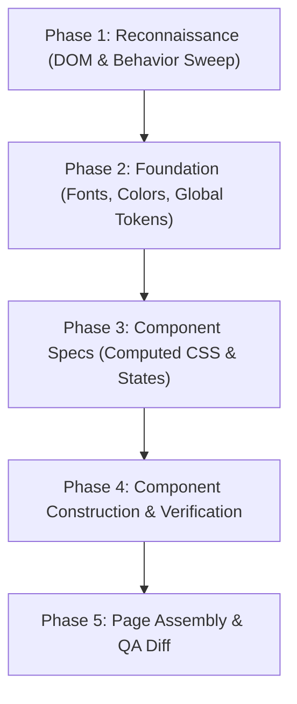

# Clone Website Skill

A comprehensive, production-grade guide for reverse-engineering and rebuilding any live website into a clean, modern Next.js (App Router), React 19, and Tailwind CSS v4 codebase.

---

## Core Principles

1. **Pixel-Perfect Emulation First**: Match colors, spacing, typography, transitions, and layout 1:1 before adding any customizations.
2. **Real Content & Real Assets**: Extract actual text, high-res images, SVG icons, and videos from the target live site. Store all media locally under `public/` for zero external latency and full offline stability.
3. **Behavior & Appearance**: A website is a living interface. Capture both static computed CSS (`getComputedStyle()`) AND dynamic behaviors (scroll triggers, hover states, sticky transforms, tab switches, and responsive breakpoints).
4. **Build Must Always Compile**: Run `tsc --noEmit` and `npm run build` after every milestone. Zero broken builds.

---

## 5-Phase Cloning Pipeline



---

## Phase 1: Reconnaissance & Topology Mapping

1. **Extract Site Metadata & Typography**:
   - Inspect `<title>`, `<meta description>`, OpenGraph, Twitter cards, and favicon.
   - Detect font families (e.g. Google Fonts like `Poppins`, `Inter`, `Geist`, etc.) and exact font weights.

2. **DOM Topology Mapping**:
   - Break the page down from top to bottom into modular, reusable section components:
     - `Header` (Navigation, logos, action buttons, mobile menu)
     - `HeroSection` (Video / image banner, hero headlines, CTA)
     - `InformationSection` / `StatsBanner` (Key statistics, trust badges)
     - `FeatureSection` / `CardsSection` (Challenge cards, feature grids)
     - `SplitSection` / `DualColumn` (Side-by-side media and rich copy)
     - `ShowcaseSection` / `TextMediaSection` (Alternating content blocks)
     - `AwardsSection` / `SliderSection` (Testimonials, client logos, badge carousels)
     - `BannerCtaSection` (Call to action banner with background photography)
     - `Footer` (Multi-column links, copyright, social icons)

---

## Phase 2: Foundation Setup

1. **Global CSS & Tokens (`src/app/globals.css`)**:
   - Configure Tailwind CSS v4 design tokens:
     ```css
     @import "tailwindcss";
     @import "tw-animate-css";
     @import "shadcn/tailwind.css";

     @theme inline {
       --font-sans: var(--font-primary), sans-serif;
       --color-brand-primary: #...;
       --color-brand-secondary: #...;
       --color-brand-bg: #...;
     }
     ```
   - Add specialized shape utilities (such as inverted concave corner SVGs, custom scrollbars, or sinusoidal wave backgrounds).

2. **Root Layout (`src/app/layout.tsx`)**:
   - Initialize Google Fonts via `next/font/google`:
     ```tsx
     import { Poppins } from "next/font/google";

     const font = Poppins({
       variable: "--font-primary",
       subsets: ["latin"],
       weight: ["300", "400", "500", "600", "700"],
       display: "swap",
     });
     ```
   - Export full metadata and favicon links.

3. **Asset Ingestion Script (`scripts/download-assets.mjs`)**:
   - Create a dedicated Node.js download script to fetch all images, logos, icons, and MP4 videos to local directories (`public/images/`, `public/videos/`).

---

## Phase 3: Component Specification

For each section, define exact computed styling, responsive rules, and interaction models:

### Inverted Corner Cutout Pattern (Signature UI Technique)
```css
.cutout-corner-top-right::before {
  content: "";
  position: absolute;
  top: 0;
  right: -23px;
  width: 24px;
  height: 24px;
  background-image: url("data:image/svg+xml,%3Csvg xmlns='http://www.w3.org/2000/svg' width='24' height='24' fill='none' viewBox='0 0 24 24'%3E%3Cpath fill='%23EDECEC' fill-rule='evenodd' d='M0 24C0 10.745 10.745 0 24 0H0z' clip-rule='evenodd'/%3E%3C/svg%3E");
  background-repeat: no-repeat;
  background-size: contain;
}
```

### Video Background Component Pattern
```tsx
<div className="absolute inset-0 w-full h-full z-0 overflow-hidden">
  <video
    autoPlay
    loop
    muted
    playsInline
    poster="/images/hero-poster.webp"
    className="absolute min-w-full min-h-full w-auto h-auto top-1/2 left-1/2 -translate-x-1/2 -translate-y-1/2 object-cover"
  >
    <source src="/videos/hero-video.mp4" type="video/mp4" />
  </video>
  <div className="absolute inset-0 bg-black/35 z-10" />
</div>
```

---

## Phase 4 & 5: Assembly, Build & Quality Assurance

1. **Assemble in `src/app/page.tsx`**:
   - Import all individual section components.
   - Maintain fluid semantic hierarchy (`<header>`, `<main>`, `<section>`, `<footer>`).

2. **Run Strict Multi-Stage Build Checks**:
   - Run typecheck: `npm.cmd run typecheck` (`tsc --noEmit`)
   - Run linter: `npm.cmd run lint` (`eslint`)
   - Run production build: `npm.cmd run build` (`next build`)
   - Run combined pipeline: `npm.cmd run check`

3. **Verify Interactive & Responsive States**:
   - Check desktop (1440px), tablet (768px), and mobile (390px).
   - Test sticky header transitions, hamburger drawer toggles, and video playback.
