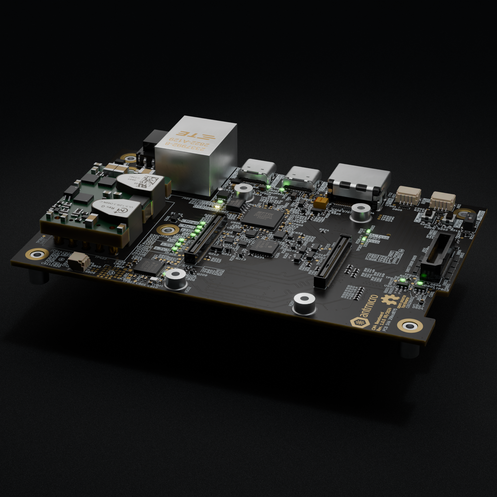

# CM4 Baseboard

Copyright (c) 2024-2026 [Antmicro](https://www.antmicro.com)

## Overview

This project contains open hardware design files for a baseboard supporting System on Modules (SoMs) with Raspberry Pi Compute Module rev. 4.0 (CM4) pinout.
The baseboard is also electrically compatible with Compute Module rev. 5.0 (CM5).
Please note that the pins associated with CAM0 and DSI0 on the [CM4 module](https://www.raspberrypi.com/products/compute-module-4) were changed to USB 3.0 ports on the [CM5 module](https://www.raspberrypi.com/products/compute-module-5).
Please refer to the schematics of the baseboard and respective compute modules for details.

The design files were prepared in KiCad 9.x.

## Key features

* Compatible with Raspberry Pi CM4 and CM5 modules 
* Includes extended features to support [Antmicro PolarFire SoM](https://github.com/antmicro/polarfire-som)
* Compact size (107mm x 68mm)
* Multiple power supply options (USB-PD, PoE, 9-15V DC Input Connector) with automatic switching between sources
* M.2 (key-M) 2280 PCIe 2.0 x4 slot for NVMe storage
* USB-C 2.0 DRP (5V with 1.5A) output
* USB-C UFP with Power Delivery (15V with 3A) input with USB-4xUART/USB-I2C bridge
* Gigabit Ethernet with PoE
* DSI Adapter Connector for customized display adapters
* Antmicro's 50-pin FFC camera connector for external camera modules and video accessories
* HDMI 2.0 output
* microSD slot
* 2x QWIIC expansion connectors for external sensors and peripherals
* NFC transceiver (PN7160) with an external antenna connector
* Expansion connector

The baseboard is electrically compatible with the following video converters and accessories developed by Antmicro: 

* [GMSL Deserializer Board](https://github.com/antmicro/gmsl-deserializer)
* [SDI-MIPI Video Converter](https://github.com/antmicro/sdi-mipi-video-converter-hw)
* [HDMI to MIPI CSI-2 Bridge](https://github.com/antmicro/hdmi-mipi-bridge)
* [Composite Video to MIPI CSI-2 Bridge](https://github.com/antmicro/cvbs-mipi-bridge)

## Project structure

The main directory contains KiCad PCB project files, the LICENSE, and this README, and the `img` directory contains graphics for this README.

## License

This project is published under the [Apache-2.0](LICENSE) license.
